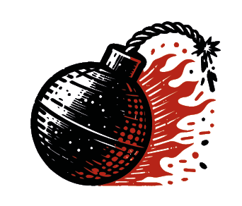
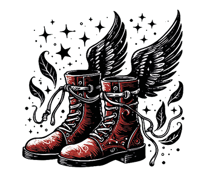
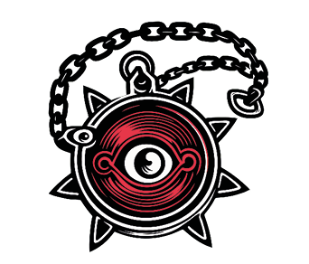
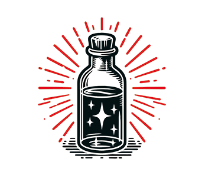
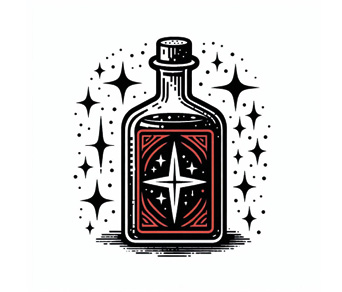
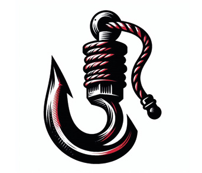
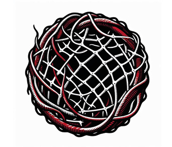
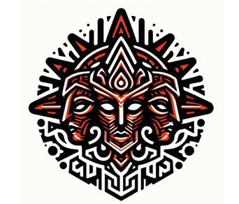
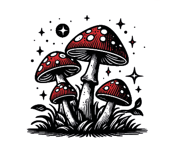

# Appendix

## Equipment

Equipment can be acquired during Missions or throughout a Campaign. Each item has a point cost, representing its value during Campaign play.

- To gain equipment, a model must Loot an Object Marker or Treasure within 1“ and roll on the Equipment Table.
- Roll D66 to determine a random item from the list.

### Equipment Table

| 🎲  | Name                         | PT  |
|-----|------------------------------|-----|
| 11  | Trap                         | 0   |
| 12  | Poison                       | 10  |
| 13  | Fire Bomb                    | 13  |
| 14  | Magic Scroll of Healing      | 10  |
| 15  | Boots of Flying              | 12  |
| 16  | Amulet of Protection         | 12  |
| 22  | Blessed Water                | 4   |
| 23  | Magic Scroll of Reanimation  | 23  |
| 24  | Alcohol                      | 11  |
| 25  | Flash Powder                 | 3   |
| 26  | Grappling Hook               | 6   |
| 33  | Spectral Band                | 7   |
| 34  | Lucky Charm                  | 8   |
| 35  | Net                          | 5   |
| 36  | Idol of the Gods             | 15  |
| 44  | Magic Mushrooms              | 17  |
| 45  | Spy Glass                    | 5   |
| 46  | Telescope                    | 8   |
| 55  | Magic Scroll of Cursed Souls | 6   |
| 56  | Healing Potion               | 12  |
| 66  | Magic Scroll of Resurrection | 25  |

<table>
<tbody>
<tr>
<td colspan="4"></td>
</tr>
<tr>
<td colspan="4">
Trap
</td>
</tr>
<tr>
<td>
11
</td>
<td>
D66
</td>
<td>
0
</td>
<td>
Points
</td>
</tr>
<tr>
<td colspan="4">
Model gets hit by the following attack. Counts as a Shooting attack.

ATK 3, HTV 4+, DMG 3, CRT 4
</td>
</tr>
</tbody>
</table>

<table>
<tbody>
<tr>
<td colspan="4"></td>
</tr>
<tr>
<td colspan="4">
Poison
</td>
</tr>
<tr>
<td>
12
</td>
<td>
D66
</td>
<td>
10
</td>
<td>
Points
</td>
</tr>
<tr>
<td colspan="4">
The weapons of the model gain the Poison trait.
</td>
</tr>
</tbody>
</table>

<table>
<tbody>
<tr>
<td colspan="4"></td>
</tr>
<tr>
<td colspan="4">
Fire Bomb
</td>
</tr>
<tr>
<td>
13
</td>
<td>
D66
</td>
<td>
13
</td>
<td>
Points
</td>
</tr>
<tr>
<td colspan="4">
Counts as a Ranged Weapon:

RNG 6“, ATK 4, HTV 4+, DMG 3, CRT 4 
Blast, Limited
</td>
</tr>
</tbody>
</table>

<table>
<tbody>
<tr>
<td colspan="4"></td>
</tr>
<tr>
<td colspan="4">
Magic Scroll of Healing
</td>
</tr>
<tr>
<td>
14
</td>
<td>
D66
</td>
<td>
10
</td>
<td>
Points
</td>
</tr>
<tr>
<td colspan="4">
This model may perform the special action HEAL once. Remove after use.
</td>
</tr>
</tbody>
</table>

<table>
<tbody>
<tr>
<td colspan="4"></td>
</tr>
<tr>
<td colspan="4">
Boots of Flying
</td>
</tr>
<tr>
<td>
15
</td>
<td>
D66
</td>
<td>
12
</td>
<td>
Points
</td>
</tr>
<tr>
<td colspan="4">
Grants the trait Fly.
</td>
</tr>
</tbody>
</table>

<table>
<tbody>
<tr>
<td colspan="4"></td>
</tr>
<tr>
<td colspan="4">
Amulet of Protection
</td>
</tr>
<tr>
<td>
16
</td>
<td>
D66
</td>
<td>
12
</td>
<td>
Points
</td>
</tr>
<tr>
<td colspan="4">
Grants the trait Protected.
</td>
</tr>
</tbody>
</table>

<table>
<tbody>
<tr>
<td colspan="4"></td>
</tr>
<tr>
<td colspan="4">
Blessed Water
</td>
</tr>
<tr>
<td>
22
</td>
<td>
D66
</td>
<td>
4
</td>
<td>
Points
</td>
</tr>
<tr>
<td colspan="4">
This model may use the special action 
CLEANSE. Remove after use.
</td>
</tr>
</tbody>
</table>

<table>
<tbody>
<tr>
<td colspan="4"></td>
</tr>
<tr>
<td colspan="4">
Magic Scroll of Reanimate the Dead
</td>
</tr>
<tr>
<td>
23
</td>
<td>
D66
</td>
<td>
23
</td>
<td>
Points
</td>
</tr>
<tr>
<td colspan="4">
Grants the special action Cast a Spell with the ability Reanimate the Dead: Any defeated model within 8“ can be revived as a Zombie with its original weapons: MOV 3“, DEF 3, SAV 6+, WND 8; Resilient, Slow, Necrotic Hunger. Usable once per game.
</td>
</tr>
</tbody>
</table>

<table>
<tbody>
<tr>
<td colspan="4"></td>
</tr>
<tr>
<td colspan="4">
Alcohol
</td>
</tr>
<tr>
<td>
24
</td>
<td>
D66
</td>
<td>
11
</td>
<td>
Points
</td>
</tr>
<tr>
<td colspan="4">
Grants the Traits Fearless and Resilient until the end of the game. Remove after use.
</td>
</tr>
</tbody>
</table>

<table>
<tbody>
<tr>
<td colspan="4"></td>
</tr>
<tr>
<td colspan="4">
Flash Powder
</td>
</tr>
<tr>
<td>
25
</td>
<td>
D66
</td>
<td>
3
</td>
<td>
Points
</td>
</tr>
<tr>
<td colspan="4">
Reduces the AP for the action Fall Back to 1.
</td>
</tr>
</tbody>
</table>

<table>
<tbody>
<tr>
<td colspan="4"></td>
</tr>
<tr>
<td colspan="4">
Grappling Hook
</td>
</tr>
<tr>
<td>
26
</td>
<td>
D66
</td>
<td>
6
</td>
<td>
Points
</td>
</tr>
<tr>
<td colspan="4">
This model can climb or drop without spending movement or suffering penalties. It may also climb even without climbing aids.
</td>
</tr>
</tbody>
</table>

<table>
<tbody>
<tr>
<td colspan="4"></td>
</tr>
<tr>
<td colspan="4">
Spectral Band
</td>
</tr>
<tr>
<td>
33
</td>
<td>
D66
</td>
<td>
7
</td>
<td>
Points
</td>
</tr>
<tr>
<td colspan="4">
Grants the Spectral trait.
</td>
</tr>
</tbody>
</table>

<table>
<tbody>
<tr>
<td colspan="4"></td>
</tr>
<tr>
<td colspan="4">
Lucky Charm
</td>
</tr>
<tr>
<td>
34
</td>
<td>
D66
</td>
<td>
8
</td>
<td>
Points
</td>
</tr>
<tr>
<td colspan="4">
This model gains 1 Reroll per turn.
</td>
</tr>
</tbody>
</table>

<table>
<tbody>
<tr>
<td colspan="4"></td>
</tr>
<tr>
<td colspan="4">
Net
</td>
</tr>
<tr>
<td>
35
</td>
<td>
D66
</td>
<td>
5
</td>
<td>
Points
</td>
</tr>
<tr>
<td colspan="4">
Opponents in Close Combat cannot use the FALL BACK action.
</td>
</tr>
</tbody>
</table>

<table>
<tbody>
<tr>
<td colspan="4"></td>
</tr>
<tr>
<td colspan="4">
Idol of the Gods
</td>
</tr>
<tr>
<td>
36
</td>
<td>
D66
</td>
<td>
15
</td>
<td>
Points
</td>
</tr>
<tr>
<td colspan="4">
Generates 1 additional Fate Die per turn.
</td>
</tr>
</tbody>
</table>

<table>
<tbody>
<tr>
<td colspan="4"></td>
</tr>
<tr>
<td colspan="4">
Magic Mushrooms
</td>
</tr>
<tr>
<td>
44
</td>
<td>
D66
</td>
<td>
17
</td>
<td>
Points
</td>
</tr>
<tr>
<td colspan="4">
This model may perform the special action OVEREXERTION until the end of the game. Remove after use.
</td>
</tr>
</tbody>
</table>

<table>
<tbody>
<tr>
<td colspan="4"></td>
</tr>
<tr>
<td colspan="4">
Spy Glass
</td>
</tr>
<tr>
<td>
45
</td>
<td>
D66
</td>
<td>
5
</td>
<td>
Points
</td>
</tr>
<tr>
<td colspan="4">
When making a Ranged Attack, the target does not benefit from Cover.
</td>
</tr>
</tbody>
</table>

<table>
<tbody>
<tr>
<td colspan="4"></td>
</tr>
<tr>
<td colspan="4">
Telescope
</td>
</tr>
<tr>
<td>
46
</td>
<td>
D66
</td>
<td>
8
</td>
<td>
Points
</td>
</tr>
<tr>
<td colspan="4">
Improve the HTV by 1 for all ranged attacks made by this model.
</td>
</tr>
</tbody>
</table>

<table>
<tbody>
<tr>
<td colspan="4"></td>
</tr>
<tr>
<td colspan="4">
Magic Scroll of Cursed Souls
</td>
</tr>
<tr>
<td>
55
</td>
<td>
D66
</td>
<td>
6
</td>
<td>
Points
</td>
</tr>
<tr>
<td colspan="4">
Select one enemy model. That model immediately gains the status effect Cursed. Remove after use.
</td>
</tr>
</tbody>
</table>

<table>
<tbody>
<tr>
<td colspan="4"></td>
</tr>
<tr>
<td colspan="4">
Healing Potion
</td>
</tr>
<tr>
<td>
56
</td>
<td>
D66
</td>
<td>
12
</td>
<td>
Points
</td>
</tr>
<tr>
<td colspan="4">
Select a friendly model within 1“. That model regains 2D6 lost Wounds. 
If this healing fully restores the model’s WND to its original value, any existing Injury effects are also removed.
</td>
</tr>
</tbody>
</table>

<table>
<tbody>
<tr>
<td colspan="4"></td>
</tr>
<tr>
<td colspan="4">
Magic Scroll of Resurrection
</td>
</tr>
<tr>
<td>
66
</td>
<td>
D66
</td>
<td>
25
</td>
<td>
Points
</td>
</tr>
<tr>
<td colspan="4">
Grants the special action Cast a Spell with the ability Resurrection: This model may choose a friendly model that is Defeated. On a roll of 4+, the model returns to life with half its WND value. Remove after use.
</td>
</tr>
</tbody>
</table>

## Model Traits

<table>
<thead>
<tr>
<th scope="col">
Name
</th>
<th scope="col">
Description
</th>
<th scope="col">
PT
</th>
</tr>
</thead>
<tbody>
<tr>
<td>
Ambush
</td>
<td>
This model starts the game in reserve. At any turn after the first, deploy it anywhere, at least 9″ from any enemy model.
</td>
<td>
4
</td>
</tr>
<tr>
<td>
Arcane
</td>
<td>
Allows the CAST A SPELL action.
</td>
<td>
25
</td>
</tr>
<tr>
<td>
Archmage
</td>
<td>
May cast multiple spells per turn using the CAST A SPELL action.
</td>
<td>
18
</td>
</tr>
<tr>
<td>
Balanced
</td>
<td>
Once per combat, you may reroll one Attack Die in Close Combat.
</td>
<td>
2
</td>
</tr>
<tr>
<td>
Buckler
</td>
<td>
Get +1 Block Die in Close Combat. Block succeeds on 3+, critical on 6.
</td>
<td>
5
</td>
</tr>
<tr>
<td>
Ceaseless
</td>
<td>
Re-roll any Attack Dice results of 1.
</td>
<td>
7
</td>
</tr>
<tr>
<td>
Channeler
</td>
<td>
Roll 3D6 instead of 2D6 when generating Arcane Energy.
</td>
<td>
7
</td>
</tr>
<tr>
<td>
Conduit
</td>
<td>
Rolls of 1 when generating Arcane Energy do not cause damage.
</td>
<td>
7
</td>
</tr>
<tr>
<td>
Creature
</td>
<td>
Cannot perform INTERACT.
</td>
<td>
-3
</td>
</tr>
<tr>
<td>
Creature Command
</td>
<td>
May use Command, but only targeting a model with the Creature trait.
</td>
<td>
6
</td>
</tr>
<tr>
<td>
Cursed
</td>
<td>
Starts the game with the Cursed status effect.
</td>
<td>
-3
</td>
</tr>
<tr>
<td>
Divine
</td>
<td>
May use the CLEANSE and INVOCATON actions.
</td>
<td>
27
</td>
</tr>
<tr>
<td>
Fast
</td>
<td>
Gets +2" MOV for CHARGE or FALL BACK actions.
</td>
<td>
4
</td>
</tr>
<tr>
<td>
Fearless
</td>
<td>
Immune to the Fearful status effect.
</td>
<td>
4
</td>
</tr>
<tr>
<td>
Fly
</td>
<td>
Ignores terrain and obstacles when moving. The model’s movement must start and end on open terrain.
</td>
<td>
12
</td>
</tr>
<tr>
<td>
Fungus Brew
</td>
<td>
"Model may roll a D6 at the beginning of its activation. It gets the following traits or status effect until the end of the turn. 
1 Stupidity 
2-3 Fearful 
4-5 Resilient 
6 Ceaseless"
</td>
<td>
2
</td>
</tr>
<tr>
<td>
Furious
</td>
<td>
May perform the FIGHT action twice per activation.
</td>
<td>
5
</td>
</tr>
<tr>
<td>
Group
</td>
<td>
Up to 2 models with this trait may activate in succession.
</td>
<td>
3
</td>
</tr>
</tbody>
</table>

<table>
<thead>
<tr>
<th scope="col">
Name
</th>
<th scope="col">
Description
</th>
<th scope="col">
PT
</th>
</tr>
</thead>
<tbody>
<tr>
<td>
Guard
</td>
<td>
May perform the GUARD action for +1 Block Die in the next melee combat.
</td>
<td>
6
</td>
</tr>
<tr>
<td>
Gunslinger
</td>
<td>
May perform the TAKE AIM action; may MOVE and SHOOT in the same activation.
</td>
<td>
12
</td>
</tr>
<tr>
<td>
Hawkeye
</td>
<td>
Ranged attack rolls of 5+ are critical successes.
</td>
<td>
-5
</td>
</tr>
<tr>
<td>
Heavy Armor
</td>
<td>
Gets +2 Block Dice in Close Combat. To succeed, each roll must equal or exceed the model’s SAV value. A 6 is always a critical success. The model cannot use RUN.
</td>
<td>
6
</td>
</tr>
<tr>
<td>
Helmet
</td>
<td>
Ignores Head Injuries (result 1) from Critical Injuries table.
</td>
<td>
2
</td>
</tr>
<tr>
<td>
Hero
</td>
<td>
May use the OVEREXERTION action.
</td>
<td>
5
</td>
</tr>
<tr>
<td>
Horse Rider
</td>
<td>
Cannot climb. May traverse Small Objects and Field Defenses without penalty.
</td>
<td>
4
</td>
</tr>
<tr>
<td>
Hunter
</td>
<td>
May use SHOOT twice per activation.
</td>
<td>
5
</td>
</tr>
<tr>
<td>
Immobile
</td>
<td>
Cannot MOVE, RUN, CHARGE or FALL BACK.
</td>
<td>
-20
</td>
</tr>
<tr>
<td>
Invulnerable
</td>
<td>
Save (SAV) value cannot be modified by any rule or weapon.
</td>
<td>
5
</td>
</tr>
<tr>
<td>
Large Group
</td>
<td>
Up to 3 models with this trait may activate in succession.
</td>
<td>
6
</td>
</tr>
<tr>
<td>
Leader
</td>
<td>
May use the COMMAND action.
</td>
<td>
20
</td>
</tr>
<tr>
<td>
Life Link
</td>
<td>
Each Critical Hit that deals damage heals 1 Wound.
</td>
<td>
8
</td>
</tr>
<tr>
<td>
Light Armor
</td>
<td>
No movement penalties for using Climb or Traverse.
</td>
<td>
2
</td>
</tr>
<tr>
<td>
Mastery
</td>
<td>
If you score at least one critical success in an Attack Roll, roll 1 additional Attack Die immediately. This die is resolved as part of the same attack sequence.
</td>
<td>
9
</td>
</tr>
<tr>
<td>
Medium Armor
</td>
<td>
Get +1 Block Dice in Close Combat. To succeed, the roll must equal or exceed the model’s SAV value. A 6 is always a critical success.
</td>
<td>
3
</td>
</tr>
<tr>
<td>
Necrotic Hunger
</td>
<td>
Heals D6 Wounds when defeating an enemy in Close Combat.
</td>
<td>
6
</td>
</tr>
<tr>
<td>
Protected
</td>
<td>
"In combat, the model may retain 1 Attack or Defence Die as a normal success without rolling it. 
In Close Combat, this counts as a normal Block Die. 
In Ranged Combat, this counts as a normal Defense Die."
</td>
<td>
6
</td>
</tr>
<tr>
<td>
Regeneration
</td>
<td>
After receiving damage, roll 1D6. On 5+, ignore that damage.
</td>
<td>
8
</td>
</tr>
</tbody>
</table>

| Name | Description | PT |
|----|----|----|
| Relentless | Once per turn, re-roll any number of Attack Dice once in Close Combat.  | 15 |
| Resilient | Unaffected by Fearful and Critical Injuries. | 7 |
| Robust | Unaffected by Critical Injuries. | 3 |
| Scout | This model is deployed after all other models have been placed. Immediately after deployment, it may make a free move of up to 2× its MOV. | 6 |
| Shield | Grants +1 Block Die in Close Combat. This Die succeeds on a 3+ and is a critical success on a 6. Model counts as in Cover. | 7 |
| Silent | May perform HIDE and SHOOT in the same activation. | 4 |
| Slow | Cannot RUN or Jump. | -2 |
| Sniper | May target enemies engaged in Melee without applying the Shoot into Combat disadvantage of potentially hitting a friendly model. May also use the TAKE AIM action. | 8 |
| Spectral | May move through terrain, but not end inside it. Cannot see through intervening terrain. | 7 |
| Stealth | Considered in Cover if at least a part of its volume is obscured by a terrain feature. | 4 |
| Strider | Ignores the effects of Difficult or Dangerous terrain. | 6 |
| Stupidity | Roll a D6 before using an action. On 1, the action is not performed and the AP is lost. | -5 |
| Swift | Ignore climbing movement penalty. | 3 |
| Tank | If an enemy declares a Charge against a friendly model within its range and has an unobstructed path to this model, it must instead target this model. | 6 |
| Teleport | Use the MOVE action to move the model up to 3× its MOV in a straight line to a position it can see. Ignore all obstacles and terrain in between. Counts as a CHARGE action if the movement ends in Melee Range of an enemy model. | 9 |
| Tough | Whenever this model suffers damage from a resolved normal or critical success, reduce that damage by 1. | 8 |

| Name | Description | PT |
|----|----|----|
| Tougher | Whenever this model suffers damage from a resolved normal or critical success, reduce that damage by 2. | 16 |
| Toughest | Whenever this model suffers damage from a resolved normal or critical success, reduce that damage by 3. | 24 |
| Undead | Immune to Fearful, Poisoned, and Stunned. | 4 |
| Veteran | May use GUARD and TAKE AIM actions. | 11 |

## Weapon Traits

| Name | Description | PT |
|----|----|----|
| Ancient | Once per combat, re-roll 1 failed Attack Die. | 4 |
| Armor Piercing | When resolving attacks with this weapon, worsen the Defender’s SAV by 1 (to a minimum of 6+). | 7 |
| Armor Shatter | When resolving attacks with this weapon, worsen the Defender’s SAV by 2 (to a minimum of 6+). | 13 |
| Blast | When resolving a Ranged Attack with this weapon, after the initial target is resolved, all models within 3" of that target are also attacked with the same weapon profile, but with ATK reduced by 1. | 17 |
| Blighted | When this weapon inflicts damage with a critical success, the target also gains the Cursed status effect. | 6 |
| Brutal | When defending against this weapon, only critical successes on Defense or Block Dice can cancel its successful attack dice. | 12 |
| Cover Breaker | Attacks made with this weapon ignore all defensive benefits from Cover, including automatically retained Defense Dice. | 6 |
| Critical | When making Attack Rolls with this weapon, rolls of 5+ count as critical successes. | 6 |
| Deadly | Successful critical attack dice from this weapon inflict Fatal Damage instead of normal damage. Fatal Damage cannot be blocked or saved. | 18 |
| Fire | Critical success also applies Burning. | 6 |
| First Strike | This model is always treated as the Attacker in Close Combat, regardless of which model initiated the fight. | 4 |
| Fusillade | When making a Ranged Attack with this weapon, you may split your Attack Dice between multiple eligible targets within range and line of sight. Resolve each target’s defense separately. | 3 |
| Harmful | Results of 1 to hit inflict 1 DMG to the Attacker without a defense possibility. | -5 |
| Heavy | This weapon cannot be used on a turn in which the model has moved. | -5 |
| Impact | After completing a Charge action, inflict D3 automatic normal successes against the charged target before resolving Close Combat. These successes are resolved as Strikes and can be defended normally. | 7 |
| Limited | May only be used once per battle. | -12 |
| Necrotic | When this weapon inflicts damage with a critical success in Close Combat, the bearer heals D3 Wounds. | 6 |
| Parry | In Close Combat, you may use a normal successful Attack Die result to block an opponent’s critical success. | 4 |
| Phantom | When this weapon inflicts damage with a critical success, the target ignores any additional Block Dice granted by Medium Armor or Heavy Armor for that attack. | 6 |
| Poison | When this weapon inflicts damage with a critical success, the target also gains the Poisoned status effect. | 7 |
| Push | In Close Combat, when you inflict damage with a critical success, you may immediately push the enemy model back 3″, following normal movement rules. | 3 |
| Reach | Can be used in Close and Ranged Combat. | 4 |
| Reloading | After this weapon is used to make a Ranged Attack, it must be reloaded by performing the INTERACT action before it can be fired again. | -5 |
| Rending | If you retain at least one critical success in an attack roll, you may upgrade one normal success to a critical success. | 10 |
| Reveal | All Hidden enemy models within 6″ of this model are immediately revealed and can be targeted. | 6 |
| Stun | When this weapon inflicts damage with a critical success, the target also gains the Stunned status effect. | 7 |
| Sweep | In Close Combat, when this weapon inflicts damage with a critical success, each other enemy model within 1″ of the target suffers D3 Fatal Wounds. | 3 |
| Throwable | May be used in Close Combat and for a single Ranged Attack per battle. After making the ranged attack, the weapon cannot be used again. | 9 |
| Two-handed | In Close Combat, during the Resolve Dice step, your opponent always resolves the first successful die against this model. Then alternate as normal. Cannot use a Shield or Buckler. | -3 |
| Unwieldy | A SHOOT or FIGHT action with this weapon costs 2 AP. This weapon cannot be used for an Overwatch reaction. | -8 |