# Appendix

## Equipment

Equipment can be acquired during Missions or throughout a Campaign. Each item has a point cost, representing its value during Campaign play.

- To gain equipment, a model must Loot an Object Marker or Treasure within 1″ and roll on the Equipment Table.
- Roll D66 to determine a random item from the list.

1.  Equipment Table

| 🎲  | Name                         | PTS |
|-----|------------------------------|-----|
| 11  | Trap                         | 0   |
| 12  | Poison                       | 10  |
| 13  | Fire Bomb                    | 13  |
| 14  | Magic Scroll of Healing      | 10  |
| 15  | Boots of Flying              | 12  |
| 16  | Amulet of Protection         | 12  |
| 22  | Blessed Water                | 4   |
| 23  | Magic Scroll of Reanimation  | 23  |
| 24  | Alcohol                      | 11  |
| 25  | Flash Powder                 | 3   |
| 26  | Grappling Hook               | 6   |
| 33  | Spectral Band                | 7   |
| 34  | Lucky Charm                  | 8   |
| 35  | Net                          | 5   |
| 36  | Idol of the Gods             | 15  |
| 44  | Magic Mushrooms              | 17  |
| 45  | Spy Glass                    | 5   |
| 46  | Telescope                    | 8   |
| 55  | Magic Scroll of Cursed Souls | 6   |
| 56  | Healing Potion               | 12  |
| 66  | Magic Scroll of Resurrection | 25  |

<table>
<tbody>
<tr>
<td colspan="4"></td>
</tr>
<tr>
<td colspan="4">
Trap
</td>
</tr>
<tr>
<td>
11
</td>
<td>
D66
</td>
<td>
0
</td>
<td>
Points
</td>
</tr>
<tr>
<td colspan="4">
Model gets hit by the following attack. Counts as a Ranged Attack.

ATK 3, HTV 4+, DMG 3, CRT 4
</td>
</tr>
</tbody>
</table>

<table>
<tbody>
<tr>
<td colspan="4">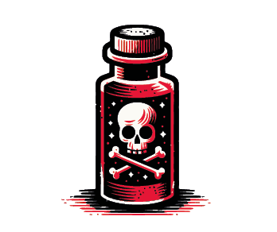</td>
</tr>
<tr>
<td colspan="4">
Poison
</td>
</tr>
<tr>
<td>
12
</td>
<td>
D66
</td>
<td>
10
</td>
<td>
Points
</td>
</tr>
<tr>
<td colspan="4">
The weapons of the model gain the Poison trait.
</td>
</tr>
</tbody>
</table>

<table>
<tbody>
<tr>
<td colspan="4">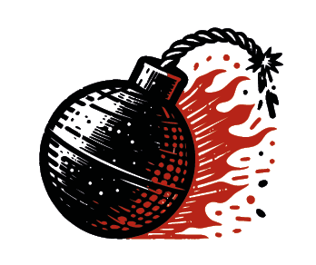</td>
</tr>
<tr>
<td colspan="4">
Fire Bomb
</td>
</tr>
<tr>
<td>
13
</td>
<td>
D66
</td>
<td>
13
</td>
<td>
Points
</td>
</tr>
<tr>
<td colspan="4">
Counts as a Ranged Weapon:

RNG 6″, ATK 4, HTV 4+, DMG 3, CRT 4 
Blast, Limited
</td>
</tr>
</tbody>
</table>

<table>
<tbody>
<tr>
<td colspan="4">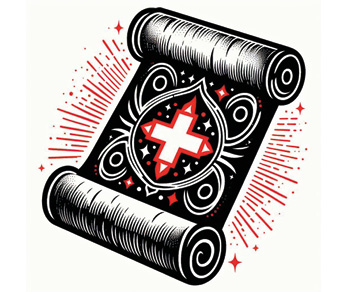</td>
</tr>
<tr>
<td colspan="4">
Magic Scroll of Healing
</td>
</tr>
<tr>
<td>
14
</td>
<td>
D66
</td>
<td>
10
</td>
<td>
Points
</td>
</tr>
<tr>
<td colspan="4">
This model may perform the special action HEAL once. Remove after use.
</td>
</tr>
</tbody>
</table>

<table>
<tbody>
<tr>
<td colspan="4">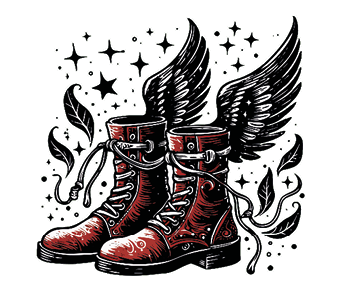</td>
</tr>
<tr>
<td colspan="4">
Boots of Flying
</td>
</tr>
<tr>
<td>
15
</td>
<td>
D66
</td>
<td>
12
</td>
<td>
Points
</td>
</tr>
<tr>
<td colspan="4">
Grants the trait Fly.
</td>
</tr>
</tbody>
</table>

<table>
<tbody>
<tr>
<td colspan="4">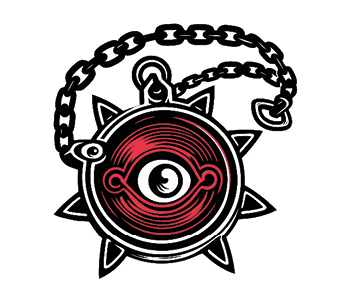</td>
</tr>
<tr>
<td colspan="4">
Amulet of Protection
</td>
</tr>
<tr>
<td>
16
</td>
<td>
D66
</td>
<td>
12
</td>
<td>
Points
</td>
</tr>
<tr>
<td colspan="4">
Grants the trait Protected.
</td>
</tr>
</tbody>
</table>

<table>
<tbody>
<tr>
<td colspan="4"></td>
</tr>
<tr>
<td colspan="4">
Blessed Water
</td>
</tr>
<tr>
<td>
22
</td>
<td>
D66
</td>
<td>
4
</td>
<td>
Points
</td>
</tr>
<tr>
<td colspan="4">
This model may use the special action 
CLEANSE. Remove after use.
</td>
</tr>
</tbody>
</table>

<table>
<tbody>
<tr>
<td colspan="4">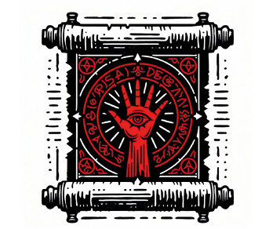</td>
</tr>
<tr>
<td colspan="4">
Magic Scroll of Reanimate the Dead
</td>
</tr>
<tr>
<td>
23
</td>
<td>
D66
</td>
<td>
23
</td>
<td>
Points
</td>
</tr>
<tr>
<td colspan="4">
Grants the special action Cast a Spell with the ability Reanimate the Dead: Any defeated model within 8″ can be revived as a Zombie with its original weapons: MOV 4″, DEF 3, SAV 6+, VIT 8; Resilient, Slow, Necrotic Hunger. Usable once per game.
</td>
</tr>
</tbody>
</table>

<table>
<tbody>
<tr>
<td colspan="4">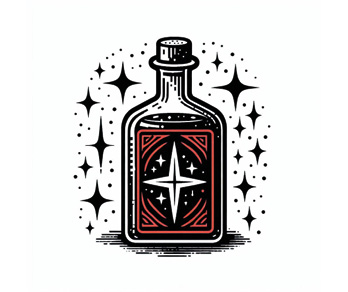</td>
</tr>
<tr>
<td colspan="4">
Alcohol
</td>
</tr>
<tr>
<td>
24
</td>
<td>
D66
</td>
<td>
11
</td>
<td>
Points
</td>
</tr>
<tr>
<td colspan="4">
Grants the Traits Fearless and Resilient until the end of the game. Remove after use.
</td>
</tr>
</tbody>
</table>

<table>
<tbody>
<tr>
<td colspan="4">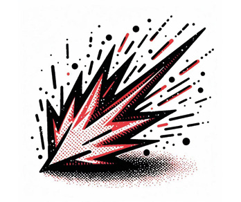</td>
</tr>
<tr>
<td colspan="4">
Flash Powder
</td>
</tr>
<tr>
<td>
25
</td>
<td>
D66
</td>
<td>
3
</td>
<td>
Points
</td>
</tr>
<tr>
<td colspan="4">
Reduces the ACT for the action Fall Back to 1.
</td>
</tr>
</tbody>
</table>

<table>
<tbody>
<tr>
<td colspan="4">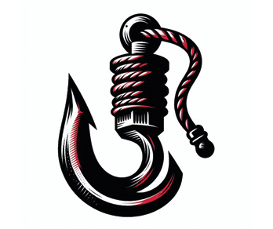</td>
</tr>
<tr>
<td colspan="4">
Grappling Hook
</td>
</tr>
<tr>
<td>
26
</td>
<td>
D66
</td>
<td>
6
</td>
<td>
Points
</td>
</tr>
<tr>
<td colspan="4">
This model can climb or drop without spending movement or suffering penalties. It may also climb even without climbing aids.
</td>
</tr>
</tbody>
</table>

<table>
<tbody>
<tr>
<td colspan="4">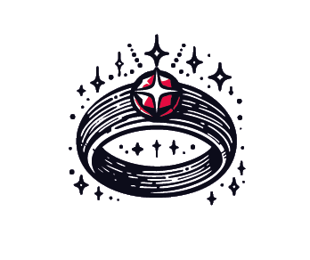</td>
</tr>
<tr>
<td colspan="4">
Spectral Band
</td>
</tr>
<tr>
<td>
33
</td>
<td>
D66
</td>
<td>
7
</td>
<td>
Points
</td>
</tr>
<tr>
<td colspan="4">
Grants the Spectral trait.
</td>
</tr>
</tbody>
</table>

<table>
<tbody>
<tr>
<td colspan="4">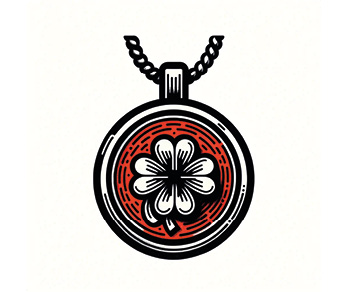</td>
</tr>
<tr>
<td colspan="4">
Lucky Charm
</td>
</tr>
<tr>
<td>
34
</td>
<td>
D66
</td>
<td>
8
</td>
<td>
Points
</td>
</tr>
<tr>
<td colspan="4">
This model gains 1 Reroll per turn.
</td>
</tr>
</tbody>
</table>

<table>
<tbody>
<tr>
<td colspan="4">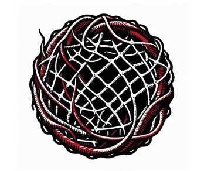</td>
</tr>
<tr>
<td colspan="4">
Net
</td>
</tr>
<tr>
<td>
35
</td>
<td>
D66
</td>
<td>
5
</td>
<td>
Points
</td>
</tr>
<tr>
<td colspan="4">
Opponents in Close Combat cannot use the FALL BACK action.
</td>
</tr>
</tbody>
</table>

<table>
<tbody>
<tr>
<td colspan="4">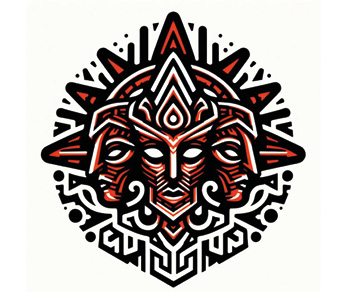</td>
</tr>
<tr>
<td colspan="4">
Idol of the Gods
</td>
</tr>
<tr>
<td>
36
</td>
<td>
D66
</td>
<td>
15
</td>
<td>
Points
</td>
</tr>
<tr>
<td colspan="4">
Generates 1 additional Fate Die per turn.
</td>
</tr>
</tbody>
</table>

<table>
<tbody>
<tr>
<td colspan="4"></td>
</tr>
<tr>
<td colspan="4">
Magic Mushrooms
</td>
</tr>
<tr>
<td>
44
</td>
<td>
D66
</td>
<td>
17
</td>
<td>
Points
</td>
</tr>
<tr>
<td colspan="4">
This model may perform the special action OVEREXERTION until the end of the game. Remove after use.
</td>
</tr>
</tbody>
</table>

<table>
<tbody>
<tr>
<td colspan="4"></td>
</tr>
<tr>
<td colspan="4">
Spy Glass
</td>
</tr>
<tr>
<td>
45
</td>
<td>
D66
</td>
<td>
5
</td>
<td>
Points
</td>
</tr>
<tr>
<td colspan="4">
When making a Ranged Attack, the target does not benefit from Cover.
</td>
</tr>
</tbody>
</table>

<table>
<tbody>
<tr>
<td colspan="4">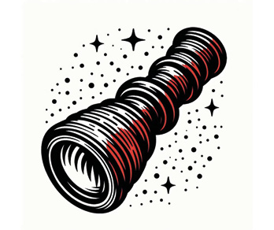</td>
</tr>
<tr>
<td colspan="4">
Telescope
</td>
</tr>
<tr>
<td>
46
</td>
<td>
D66
</td>
<td>
8
</td>
<td>
Points
</td>
</tr>
<tr>
<td colspan="4">
HTV improved by 1 for all ranged attacks made by this model.
</td>
</tr>
</tbody>
</table>

<table>
<tbody>
<tr>
<td colspan="4">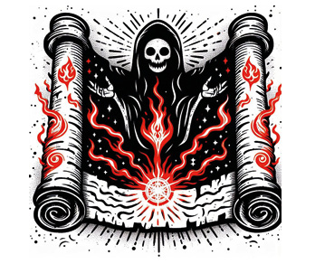</td>
</tr>
<tr>
<td colspan="4">
Magic Scroll of Cursed Souls
</td>
</tr>
<tr>
<td>
55
</td>
<td>
D66
</td>
<td>
6
</td>
<td>
Points
</td>
</tr>
<tr>
<td colspan="4">
Select one enemy model. That model immediately gains the status effect Cursed. Remove after use.
</td>
</tr>
</tbody>
</table>

<table>
<tbody>
<tr>
<td colspan="4">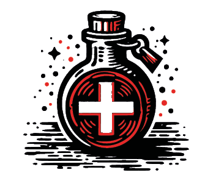</td>
</tr>
<tr>
<td colspan="4">
Healing Potion
</td>
</tr>
<tr>
<td>
56
</td>
<td>
D66
</td>
<td>
12
</td>
<td>
Points
</td>
</tr>
<tr>
<td colspan="4">
Select a friendly model within 1″. That model regains 2D6 lost Vitality. 
If this healing fully restores the model’s VIT to its original value, any existing Injury effects are also removed.
</td>
</tr>
</tbody>
</table>

<table>
<tbody>
<tr>
<td colspan="4"></td>
</tr>
<tr>
<td colspan="4">
Magic Scroll of Resurrection
</td>
</tr>
<tr>
<td>
66
</td>
<td>
D66
</td>
<td>
25
</td>
<td>
Points
</td>
</tr>
<tr>
<td colspan="4">
Grants the special action Cast a Spell with the ability Resurrection: This model may choose a friendly model that is Defeated. On a roll of 4+, the model returns to life with half its VIT value. Remove after use.
</td>
</tr>
</tbody>
</table>

## Model Traits

| Name | Description | PTS |
|----|----|----|
| Ambush | This model starts the game in reserve. At any turn after the first, deploy it anywhere, at least 9" from any enemy model. | 4 |
| Arcane | Allows the CAST A SPELL action. | 25 |
| Archmage | May cast multiple spells per turn using the CAST A SPELL action. | 18 |
| Artificer | May use COMMAND, but only targeting a model with the Construct trait. | 5 |
| Assassin | Gets HTV improved by 1 if the model is the Attacker in Close Combat. | 7 |
| Balanced | Once per combat, you may reroll one Attack Die in Close Combat. | 2 |
| Buckler | Grants 1 Block Die. It cannot block a critical success. | 4 |
| Ceaseless | Re-roll any Attack Dice results of 1. | 7 |
| Channeler | Roll 3D6 instead of 2D6 when generating Arcane Energy. | 7 |
| Cleric | May use the CLEANSE special action. When using CLEANSE, the target also regains D3 Vitality. | 18 |
| Conduit | Rolls of 1 when generating Arcane Energy do not cause damage. | 18 |
| Creature | Cannot perform INTERACT. Cannot be given weapons or equipment; it only fights with the natural weapons listed in its profile. | -3 |
| Creature Command | May use COMMAND, but only targeting a model with the Creature trait. | 6 |
| Cursed | Starts the game with the Cursed status effect. | -3 |
| Divine | May use the CLEANSE and INVOCATION actions. | 27 |
| Duellist | In Close Combat, retain 1 Attack Die as a normal success without rolling it. It may only be spent to Parry. | 5 |
| Fast | Gets +2" MOV for CHARGE or FALL BACK actions. | 4 |
| Fear | Each critical hit that causes damage gives the enemy model the Fearful status. | 6 |
| Fearless | Immune to the Fearful status effect. | 2 |
| Fly | Ignores terrain and obstacles when moving. The model's movement must start and end on open terrain. | 12 |
| Fungus Brew | Model may roll a D6 at the beginning of its activation. It gets the following traits or status effect until the end of the turn. 1 Stupidity 2-3 Fearful 4-5 Resilient 6 Ceaseless | 2 |
| Furious | May perform the FIGHT action twice per activation. | 5 |
| Guard | Any or all Block Dice may be re-rolled once. | 6 |
| Gunslinger | When this model performs QUICK SHOT, ignore the HTV penalty. | 8 |
| Hardened | The first time this model would suffer a Critical Injury each game, ignore it. | 3 |
| Hawkeye | Ranged attack rolls of 5+ are critical successes. | 4 |
| Heavy Armor | Grants 1 Block Die. Roll 2 Dice and keep the higher result. The model cannot use RUN. | 6 |
| Helmet | Ignores Head Injuries (result 1) from Critical Injuries table. | 2 |
| Henchmen | Up to 2 models with this trait may activate in succession. Can only have traits from Body Type and Armor. | 3 |
| Hero | May use the OVEREXERTION action. | 5 |
| Hunter | May use SHOOT (including QUICK SHOT) twice per activation. | 6 |
| Immobile | Cannot MOVE, RUN, CHARGE or FALL BACK. | -20 |
| Invulnerable | Save (SAV) value cannot be modified by any rule or weapon. | 5 |
| Leader | May use the COMMAND action. | 20 |
| Life Link | Each Critical Hit that deals damage heals 1 Vitality. | 8 |
| Lifeless | Immune to Fearful and Poisoned. | 5 |
| Light Armor | No movement penalties for using Climb or Traverse. | 2 |
| Marksman | May perform the TAKE AIM action. | 5 |
| Massive | Any successful resolved hit that inflicts Damage on this model is reduced by 1. This model can never gain the Hidden status. Enemy Ranged Attacks against this model improve their HTV by 1. | 4 |
| Mastery | If you score at least one critical success in an Attack Roll, roll 1 additional Attack Die immediately. This die is resolved as part of the same attack sequence. | 9 |
| Medic | May use the HEAL special action. | 6 |
| Medium Armor | Grants 1 Block Die. | 3 |
| Mounted | Cannot climb. May traverse Small Objects and Field Defenses without penalty. | 2 |
| Necrotic Hunger | Heals D6 Vitality when defeating an enemy in Close Combat. | 6 |
| Protected | Retain 1 Attack Die (Close Combat) or 1 Defense Die (Ranged Combat) as a normal success without rolling it. | 6 |
| Quick Draw | May use a Ranged Attack as a Reaction when an enemy model enters Line of Sight within 6" during their activation. | 5 |
| Regeneration | After receiving damage, roll 1D6. On 5+, ignore that damage. | 8 |
| Relentless | May re-roll all Attack Dice once per Close Combat.  | 13 |
| Resilient | Unaffected by Fearful and Critical Injuries. | 8 |
| Robust | Unaffected by Critical Injuries. | 3 |
| Scout | This model is deployed after all other models have been placed. Immediately after deployment, it may make a free move of up to 2× its MOV. | 6 |
| Second Sight | Friendly models within 6" may re-roll 1 Attack Die per turn. | 12 |
| Shield | Grants 1 Block Die. Model may use RAISE SHIELD special action. | 7 |
| Shield of Faith | Grants 1 Block Die in Close Combat and 1 Defense Die in Ranged Combat. | 5 |
| Slow | Cannot RUN or Jump. | -2 |
| Sniper | May target enemies engaged in Melee without applying the Shoot into Combat disadvantage of potentially hitting a friendly model. May also use the TAKE AIM action. Has no Effective Range penalty. | 14 |
| Spectral | May move through terrain, but not end inside it. Cannot see through intervening terrain. | 7 |
| Stealth | Considered in Cover if at least a part of its volume is obscured by a terrain feature. | 4 |
| Strider | Ignores the effects of Difficult or Dangerous terrain. | 6 |
| Stupidity | Roll a D6 before using an action. On 1, the action is not performed and the ACT is lost. | -5 |
| Swarm | Up to 3 models with this trait may activate in succession. | 6 |
| Swift | Ignore climbing movement penalty. | 3 |
| Taunt | Grants the special action TAUNT (1 ACT): choose an enemy model within 8″. In its next activation that model must attack this model if it can (SHOOT, including Quick Shot, or CHARGE); if it cannot, it must move towards this model. | 6 |
| Teleport | Use the MOVE action to move the model up to 3× its MOV in a straight line to a position it can see. Ignore all obstacles and terrain in between. Counts as a CHARGE action if the movement ends in Base Contact with an enemy model. | 9 |
| Tough | Whenever this model suffers damage from a resolved normal or critical success, reduce that damage by 1. | 8 |
| Tougher | Whenever this model suffers damage from a resolved normal or critical success, reduce that damage by 2. | 16 |
| Toughest | Whenever this model suffers damage from a resolved normal or critical success, reduce that damage by 3. | 24 |
| Veteran | After finishing its activation, this model may enter Overwatch without spending ACT. All restrictions of the Overwatch action apply. | 9 |

## 

## Weapon Traits

| Name | Description | PTS |
|----|----|----|
| Ancient | Once per combat, re-roll 1 failed Attack Die. | 4 |
| Armor Piercing | Ranged attacks: the Defender's SAV is worsened by 1 (min 6+). | 7 |
| Armor Shatter | Ranged attacks: the Defender rolls one Defense Die fewer (min 1) and their SAV is worsened by 1 (min 6+). | 13 |
| Black Powder | After making a Ranged Attack with this weapon, if any Attack Die shows a 1, roll once on the Misfire Table (see Ranged Combat). Resolve the misfire immediately before determining hits. After firing, this weapon must be reloaded using the INTERACT action before it can fire again. | -8 |
| Blast | When resolving a Ranged Attack with this weapon, after the initial target is resolved, all models within 3" of that target are also attacked with the same weapon profile, but with ATK reduced by 1. | 17 |
| Blessed | When this weapon inflicts damage with a critical success in combat, the bearer immediately heals 1 Vitality. | 7 |
| Blighted | When this weapon inflicts damage with a critical success, the target also gains the Cursed status effect. | 6 |
| Brutal | Only a critical success can cancel this weapon's successes, whether by Parry, Block Die (a 6) or Defense Die. | 12 |
| Cleave | If you retain at least one critical success in an attack roll, you may upgrade one normal success to a critical success. | 7 |
| Cover Breaker | Attacks ignore all benefits from Cover, including the SAV bonus. | 6 |
| Critical | When making Attack Rolls with this weapon, rolls of 5+ count as critical successes. | 6 |
| Deadly | Successful critical attack dice from this weapon inflict Fatal Damage instead of normal damage. Fatal Damage cannot be blocked or saved. | 18 |
| Disarming | On a critical success in Close Combat, choose: inflict CRT as normal, or inflict DMG and in addition Parry one of the opponent's unspent successes. | 8 |
| Fire | Critical success also applies Burning. | 6 |
| First Strike | In Close Combat, during the Resolve Dice step, this model always resolves the first successful die. Then alternate as normal. | 4 |
| Fusillade | When making a Ranged Attack with this weapon, you may split your Attack Dice between multiple eligible targets within range and line of sight. Resolve each target's defense separately. | 3 |
| Harmful | Results of 1 to hit inflict 1 DMG to the Attacker without a defense possibility. | -5 |
| Heavy | This weapon cannot be used on a turn in which the model has moved. | -5 |
| Impact | After completing a CHARGE action, inflict D3 Fatal Damage against the charged target. | 7 |
| Limited | May only be used once per battle. | -12 |
| Master Parry | In Close Combat, a normal success with this weapon may Parry a critical success. | 4 |
| Melee Shot | This weapon may be used to make a SHOOT againts a target in Base Contact. | 4 |
| Necrotic | When this weapon inflicts damage with a critical success in Close Combat, the bearer heals D3 Vitality. | 6 |
| Phantom | When this weapon inflicts damage with a critical success, the target ignores any additional Block Dice granted by Medium Armor or Heavy Armor for that attack. | 6 |
| Poison | When this weapon inflicts damage with a critical success, the target also gains the Poisoned status effect. | 6 |
| Push | In Close Combat, when you inflict damage with a critical success, you may immediately push the enemy model back 3", following normal movement rules. | 3 |
| Reach | Can be used in Close and Ranged Combat. | 3 |
| Reloading | After this weapon is used to make a Ranged Attack, it must be reloaded by performing the INTERACT action before it can be fired again. | -5 |
| Retribution | In Close Combat, when you Parry with a critical success, the cancelled die's damage (DMG or CRT) is inflicted on the opponent as Fatal Damage. | 8 |
| Reveal | All Hidden enemy models within 6" of this model are immediately revealed and can be targeted. | 6 |
| Riposte | In Close Combat, each time you Parry with this weapon, the opponent suffers 1 Fatal Damage. | 4 |
| Scatter Shot | When resolving a Ranged Attack with this weapon, after the initial target is resolved, all other models (friend or foe) within 2″ of that target are also attacked with the same weapon profile, but with ATK reduced by 1 (minimum 1). Each affected model defends separately. | 4 |
| Silent | May perform HIDE and SHOOT in the same activation. | 4 |
| Snap Shot | Quick Shot with this weapon does not worsen HTV. | 5 |
| Stun | When this weapon inflicts damage with a critical success, the target also gains the Stunned status effect. | 6 |
| Sweep | In Close Combat, when this weapon inflicts damage with a critical success, each other enemy model within 1" of the target suffers D3 Fatal Wounds. | 3 |
| Swift Strike | In close combat, the model may retain 1 Attack Die as a normal success without rolling it. | 5 |
| Throwable | May be used in Close Combat and for a single Ranged Attack per battle. After making the ranged attack, the weapon cannot be used again. | 9 |
| Two-handed | Cannot use an off-hand weapon, Shield or Buckler. Cannot RUN. | -3 |
| Unwieldy | A SHOOT or FIGHT action with this weapon costs 2 ACT. This weapon cannot be used for an Overwatch reaction. | -8 |
| Warp Tech | After making a Ranged Attack with this weapon, if any Attack Die shows a 1 or 2, roll once on the Misfire Table (see Ranged Combat). Resolve the misfire immediately before determining hits. Results of 5 and 6 count as critical. After firing, this weapon must be reloaded using the INTERACT action before it can fire again. | -5 |

