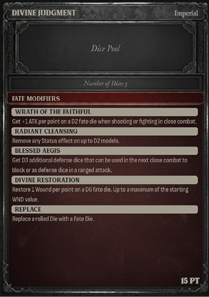

# Building a Warband

Before starting a game, agree on a total point limit with your opponent. Each model in your warband costs points based on Faction, Body Type, Tier, Armor, Class, Weapons, Gear, and Fate Modifiers. The combined total determines your warband’s cost.

- Points are equivalent to gold in campaign play.

### Suggested Warband Sizes

While Grimheim supports flexible scaling, the following points ranges are suggested for typical game sizes:

- Small: Under 500 Points
- Medium: 500–650 Points
- Large: Up to 1200 Points

### Choose a Faction

Each model must belong to one of the following factions:

- Imperial
- Undead
- Primordial
- Tribes
- Ratlings
- Mercenaries

If all models in your warband belong to the same faction, you may use that faction’s unique Fate Modifiers, Arcane Lores or Divine Lores.

If your warband includes models from multiple factions, it is considered a Mercenaries Warband.

Mercenaries

Mercenary warbands can include models from any faction. Each model costs an additional +5 points.

Mercenaries can only use the Common Fate Modifier and the Lesser Magic or Minor Rites Lores.

### Fate Modifier

Choose one Fate Modifier. Each faction offers one or more Fate Modifiers that reflect its playstyle or subfactions. A Fate Modifier increases your warband’s total cost and can only be used if all models share the same faction.

### Arcane or Divine Lore

Choose one Arcane Lore or Divine Lore. It must be accessible to models with the Arcane or Divine Trait. These Lores do not cost additional points.

### Warband Composition

There are two ways to assemble a warband:

1.  Use Existing Models / Iconic Warbands  
    You may choose pre-built models or complete Iconic Warbands as listed in the Faction chapters. These include full stats, weapons, and traits.
2.  Create Custom Characters  
    Alternatively, you may build your own unique models using the Custom Character Builder on page 78.

You may include a Leader in your warband, but it is not required.

- Easily assemble and manage your warbands, including customized models, online at grimheim.app.

## Fate Modifier

Fate Modifiers are a pool of special dice you roll each round to influence key moments like attacks, defense, movement, spells, and similar effects. Each die is tied to one specific action or mechanic and is spent as that step is rolled.

Most factions can choose between different subfactions Fate Modifiers. If not all models of your warband are from the same faction, then the follwing Common Fate Modifier applies.

- At the start of the Fate Phase, roll all Fate Dice as D6. When you use a Fate Die during the Action Phase, choose one available Fate Modifier effect. The rolled value is then interpreted as a D6, D3, D2, or D1, depending on the selected effect.
- You may use Fate Dice at any time during the Action Phase, even during the enemy‘s activation.
- Each Fate Die may be used once, applying to a single dice result or action.
- Replace uses the die result as it is, without any conversion.
- Fate Dice are used by the player, not a specific model, but may affect any model or its action.
- Some models or effects may grant extra Fate Dice.
- Unused Fate Dice expire at the end of the turn.
- The point cost are added to the warbands total cost.

<!-- -->

- Example: A D6 roll of 5 converts to 3 on a D3.

## Model Card

Each model card contains all the key information required to use that model in the game. The card is divided into five sections:

### 1. Character Image

The illustration represents the visual identity of the model. It has no gameplay function but helps establish narrative flavor and faction style.

- This area may be used to place status effect tokens during play.

### 2. Name & Faction

Lists the model’s name and faction. This determines its identity and which faction it belongs to.

### 3. Points Cost

Displayed in the upper corner, this is the cost in points (PT) to include the model in your warband. Total warband points must not exceed the agreed mission limit.

### 4. Model stats

AP (Action Points)  
The number of actions this model can perform during its activation.

MOV (Movement)  
How far the model may move (in inches) during movement actions.

DEF (Defense)  
The number of Defense Dice rolled when defending against an attack.

SAV (Save)  
The number needed on each die to block an incoming hit.

WND (Wounds)  
The total health of the model. A model with 0 Wounds is defeated.

### 5. Flavor Text

Descriptive text providing background, theme or personality. This section is optional and has no mechanical effect.

- This space can be used to place dice to track remaining Wounds during the game.

### 6. Weapons

Each weapon the model carries is listed with the following profile:

Name & Type: The name and category of the weapon (e.g. close or range).

RNG (Range): Maximum distance in inches. Weapons with RNG 1“ are used in close combat.

ATK (Attacks): Number of dice rolled when making an attack.

HTV (Hit Value): Target number required to hit.

DMG (Damage): Damage dealt by a normal hit.

CRT (Critical Damage): Damage dealt on a critical hit (a roll of 6).

Weapon Rules: Traits specific to the weapon are listed below the profile.

### 7. Model Traits

Lists unique traits or abilities the model possesses. These may grant access to special actions, provide immunities, or modify core mechanics. A model can have no more than 5 Traits in total!

## Fate Modifier Card

Each Faction in Grimheim has access to unique Fate Modifiers. Some Factions may allow a choice between multiple subfaction-specific Modifiers. If your warband includes models from different Factions, you must use the Common Fate Modifiers instead.

### 1. Name

The title of the Fate Modifier (e.g., „Common Fate“, „Imperial Fate“).

### 2. Points Cost

The cost to add the modifier to the warband.

### 3. Number of Fate Dice

Shows how many Fate Dice you may roll at each turns Fate Phase when using this modifier.

### 4. Allowed Factions

The Factions that can choose the Fate Modifier.

### 5. Dice Pool

This space can be used to place the Fate Dice.

### 6. Fate Modifiers effects

Use the available Fate Dice for the listed effects. The dice have different values depending on the chosen modifier effect, see the table for Dice Conversion. The Fate Modifiers can be used in the Action Phase.

