# Campaign Rules

Campaigns transform Grimheim from individual skirmishes into an evolving narrative where your warband grows, suffers setbacks, and forges its legend across multiple linked battles. Grimheim offers three campaign formats: Ongoing Campaigns for open-ended play with any number of players, Conquest Campaigns for a two-player war over territory, and Map Control Campaigns for a war over the districts of Grimheim itself.

## Core Campaign Rules

The following rules apply to all campaign formats:

Starting Resources

Before beginning a campaign, players agree on a common Points value for initial warband creation. In campaign mode, Points and Gold use a unified system: every Point spent on models or equipment equals 1 Gold in value. This dual currency connects warband construction with campaign economy, meaning your starting warband's point cost becomes your initial investment in the campaign.

1.  Build Your Warband

Create your starting warband within the agreed point limit, remembering that each point spent represents Gold invested. Models recruited mid-campaign follow the same principle: their point value equals their Gold cost.

See Building a Warband on page 13 for complete warband construction rules, faction options, and model costs.

1.  Victory Rewards

After each mission, Victory Points (VP) earned convert to Gold at a fixed rate of 20 Gold per VP. The Underdog converts at 30 Gold per VP instead: a player who received at least 5 VP fewer than any other player in the previous mission is the Underdog for this mission. This currency becomes your primary resource for warband development between battles.

Conquest Campaigns also award Conquest Points (CP) for territorial conquest, which determine campaign victory separately from Gold earnings.

##### Spend Gold to:

- Recruit new models at their point value cost
- Purchase equipment and upgrades
- Heal injuries at the Hub's various locations
- Access faction-specific services and training

1.  Side Quests

Optional objectives that can be undertaken during missions for additional Victory Points and narrative depth.

1.  After Battle Sequence

Between missions, your warband determines lasting consequences.

1.  Determine lasting consequences - Roll on injury tables for defeated or seriously wounded models
2.  Heal and recover - Restore wounds and remove temporary effects
3.  Visit the Hub - The warband returns to its faction's Hub to spend earned Gold on new models, upgrades, or special benefits
4.  Campaign End
    - Ongoing Campaign: The campaign ends on an agreed date, or never. The player with the most ranking points wins: 3 for a win, 1 for a draw, 0 for a loss; total Victory Points break ties.
    - Conquest Campaign: The campaign ends when one player captures the Enemy Stronghold (immediate victory) OR when both players agree to conclude, with the highest Conquest Points determining the winner.
5.  Campaign Legacy

A campaign's end need not mean your warband's story concludes. Veteran warbands may continue into new campaigns with their accumulated experience, equipment, and battle-hardened warriors, creating ongoing narratives spanning multiple campaign arcs.

Alternatively, successful warbands can retire with honor, their legends told in the taverns and halls of Grimheim while you begin fresh with a new warband and new challenges.

1.  Traits Limit

Additional Traits can only be gained during a Campaign if the total of 5 is not exceeded.

1.  Campaign Types

The three formats differ in structure and victory conditions:

#### Ongoing Campaign

An Ongoing Campaign links any number of missions into an open-ended narrative. Players join and leave while the campaign runs, warbands grow between battles, and nobody has to be present for every game.

##### Campaign Structure:

- Players play any Mission they agree on; consequences carry forward between battles (injuries, equipment, warband changes)
- Roster: every warband keeps a Roster of all its models, equipment and Gold. Before each mission the player picks a warband from the Roster up to the agreed mission limit (usually 500 to 650 points). Models left in the Roster earn no Gold and suffer no injuries. A Roster has no maximum; the mission limit bounds each game
- Joining and leaving: a player who joins a running campaign builds a warband worth the average Roster value of the other players, at most the mission limit plus 100 Gold. Leaving freezes the Roster; a returning player continues with the frozen Roster
- Pairing: any player may challenge any other, but nobody plays the same opponent three times in a row, and the player with the fewest games played challenges first. When everyone is at the table, pair players with equal numbers of wins and resolve the rest with a Roll-off. If two Rosters differ by more than 100 points, the weaker player chooses the Mission

##### Victory Conditions:

- The campaign ends on an agreed date, or never
- Ranking by wins: 3 points for a win, 1 for a draw, 0 for a loss; total Victory Points break ties

Best For: open groups, campaign nights with changing players, long-running narratives.

#### Conquest Campaign

A Conquest Campaign simulates territorial warfare with a dynamic back-and-forth struggle for control of Grimheim. Two warbands fight through escalating zones, from Neutral Grounds through Enemy Territory, with the ultimate goal of capturing and destroying the enemy's Stronghold.

##### Campaign Structure:

- Territorial Progression through five zones:\
  Your Stronghold \< Your Territory \< Neutral Grounds \> Enemy Territory \> Enemy Stronghold
- Victory pushes into enemy territory; defeat forces retreat toward your own Stronghold
- Defenders gain powerful bonuses when fighting on home ground
- Each player selects one Stronghold Mission (faction-tagged) and three Territory Missions before the campaign begins
- Conquest Points (CP):\
  In addition to Victory Points, Conquest Campaigns award Conquest Points to track how well you fare during the Campaign

##### Victory Conditions:

- Capture and destroy the Enemy Stronghold for immediate victory, OR\
  Highest Conquest Points when both players agree to conclude

Best For: Epic two-player campaigns with dramatic escalation and territorial conquest

#### Map Control Campaign

A war for the districts of Grimheim. The city becomes a campaign map of tiles that grant different advantages, held through a control mechanism. Two to six players.

Best For: groups who want a shared map and a long game. The full rules are in preparation and follow in a later edition.

1.  Conquest Campaign Rules

The following rules describe the territorial system, mission selection, defender bonuses, and victory conditions unique to Conquest Campaigns.

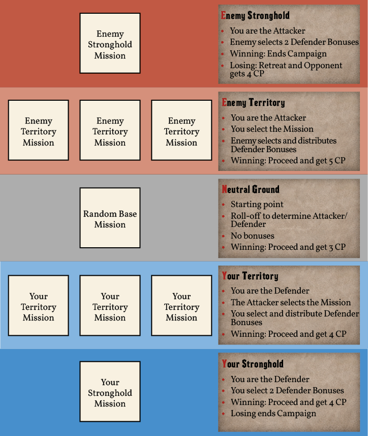

1.  Territorial System

Zone Descriptions:

##### Your Stronghold / Enemy Stronghold

- The ultimate defensive position and seat of power
- Heavily fortified with powerful defender bonuses
- Falling here means campaign defeat
- Accessed only after pushing through all previous zones
- You are always the Defender in your Stronghold and the Attacker in the Enemy Stronghold

##### Your Territory / Enemy Territory

- Home ground with moderate defender advantages
- Contains three missions chosen by the defending player before campaign starts
- Attacker selects which mission to play when this zone is contested
- You are always the Defender in your Territory and the Attacker in the Enemy Territory

##### Neutral Grounds

- The starting point of every Conquest Campaign
- No defender bonuses (balanced combat)
- Roll-off to determine Attacker/Defender
- Contains three missions played in sequence on repeated visits

1.  Conquest Points (CP)

In addition to Victory Points (which convert to Gold for warband development), Conquest Campaigns award Conquest Points to track territorial conquest and determine overall campaign victory.

| Zone            | Attacker Wins | Defender Wins |
|-----------------|---------------|---------------|
| Neutral Grounds | 3 CP          | 3 CP          |
| Territory       | 5 CP          | 4 CP          |
| Stronghold      | Total Win     | 4 CP          |

- Victory Points and Conquest Points are tracked separately

1.  Campaign Flow

All Conquest Campaigns begin at Neutral Grounds.

The campaign is a tug of war along five zones: Enemy Stronghold – Enemy Territory – Neutral Grounds – Your Territory – Your Stronghold. After each battle the winner moves the campaign one zone towards the enemy's Stronghold, the loser one zone back towards their own. A successful Stronghold defence pushes the campaign back into the defender's Territory; the defender then chooses the Territory mission.

The territorial progression follows this sequence:

Your Stronghold \< Your Territory \< Neutral Grounds \> Enemy Territory \> Enemy Stronghold

##### After each Battle:

- Award Conquest Points to the winner
- Determine territorial movement:

1.  Win: Proceed one zone toward enemy Stronghold
2.  Lose: Retreat one zone toward own Stronghold
    - Conduct After Battle Sequence
    - Set up next Mission
3.  Mission Selection

Before the campaign begins, players pre-select their mission pools based on mission tags:

##### Neutral Grounds Missions

Before starting the campaign, both players agree on 3 missions tagged as Base to form the Neutral Grounds pool. These missions are played in rotation on each visit to Neutral Grounds.

Example Neutral Grounds Pool:

- Encounter
- Border Skirmish
- Crossroads Clash

If the campaign returns to Neutral Grounds multiple times, cycle through these missions in sequence.

##### Territory Missions

Each player pre-selects 3 missions tagged as Territory for their own Territory. Record these selections before the campaign begins.

When a Territory is contested, the Attacker chooses which of the defender's 3 Territory missions to play.

Exception: If the Defender successfully defends their Stronghold and pushes back to their Territory, the Defender chooses which Territory mission to play (not the Attacker)

See the Missions chapter for all missions tagged as Territory.

##### Stronghold Missions

Each player pre-selects one mission tagged as Stronghold for their final defensive stand.

When a Stronghold is attacked, the Defender uses their chosen Stronghold mission.

See the Missions chapter for all missions tagged as Stronghold.

1.  Defender Bonuses

As a Defender, you may select from the Defender Bonus List.

- A Defender Bonus may be selected twice unless stated otherwise.

| Zone            | Defender Bonus |
|-----------------|----------------|
| Neutral Grounds | none           |
| Territory       | 0 - 2          |
| Stronghold      | 2              |

Before a Stronghold Mission is played, the Defender selects two Defender Bonuses from the Defender Bonus List.

Before a Territory Mission is selected, the Defender assigns Defender Bonus values to their three chosen Territory Missions. These values are assigned in secret and represent how many Defender Bonuses will be available if that mission is played.

- One Territory Mission is assigned a value of 2
- One is assigned a value of 1
- One is assigned a value of 0

After the Attacker has chosen the Territory Mission, the Defender reveals the assigned value for that mission and selects that many Defender Bonuses from the Defender Bonus List.

<table>
<thead>
<tr>
<th colspan="2" scope="colgroup">
Defender Bonus List
</th>
</tr>
</thead>
<tbody>
<tr>
<td headers="th_46_r0_c0">
Fortified Position
</td>
<td headers="th_46_r0_c0">
After deployment place 3 additional Barricades anywhere on the battlefield except in the enemy Deployment Zone
</td>
</tr>
<tr>
<td headers="th_46_r0_c0">
Militia
</td>
<td headers="th_46_r0_c0">
50 Gold worth of reinforcements, this mission only. Does not add to the warband value.
</td>
</tr>
<tr>
<td headers="th_46_r0_c0">
Home Advantage
</td>
<td headers="th_46_r0_c0">
All models gain the Scout trait.
</td>
</tr>
<tr>
<td headers="th_46_r0_c0">
Familiar Ground
</td>
<td headers="th_46_r0_c0">
Models ignore Difficult Terrain
</td>
</tr>
<tr>
<td headers="th_46_r0_c0">
Arcane Wards
</td>
<td headers="th_46_r0_c0">
Gains one additional Fate Die during the Fate Phase.
</td>
</tr>
<tr>
<td headers="th_46_r0_c0">
Desperate Resolve
</td>
<td headers="th_46_r0_c0">
Models in the deployment zone gain Relentless.
</td>
</tr>
<tr>
<td headers="th_46_r0_c0">
Sacred Ground
</td>
<td headers="th_46_r0_c0">
Models in the deployment zone gain Protected.
</td>
</tr>
<tr>
<td headers="th_46_r0_c0">
Last Stand
</td>
<td headers="th_46_r0_c0">
Defeated models return on a 5+ (D6) with 1 Vitality (once per model).
</td>
</tr>
<tr>
<td headers="th_46_r0_c0">
Siege Preparations
</td>
<td headers="th_46_r0_c0">
Deploy 1 Stationary Weapon that can be used by a model within 1 inch as a ranged weapon. (immobile, RNG 18", ATK 4, HTV 4+, DMG 4, CRT 6)
</td>
</tr>
</tbody>
</table>

## After Battle Sequence

Between missions during a Campaign play, warbands return to their Camp in the Grimheim Hub to recover, resupply and prepare for the next battle. The After Battle Sequence follows these steps:

1.  Lasting Consequences

All models that were Defeated or remain Injured at the end of the mission must roll on the appropriate table below to determine their fate.

#### Defeated Models

When a model was Defeated during the mission, roll a D6 and consult the table:

| D6 | Result | Effect |
|----|----|----|
| 1 | Dead | The model is permanently removed from your warband. |
| 2-4 | Permanent Wound | Roll on the Permanent Wounds table. |
| 5 | Healed | The model has recovered fully with no lasting effects. |
| 6 | Survivor | The model has recovered. Roll on the Survivor table for a bonus trait. |

#### Injured Models

When a model ended the mission with one or more Critical Injuries but was not Defeated, roll a D6:

| D6 | Result | Effect |
|----|----|----|
| 1-4 | Permanent Wound | The injuries persist. |
| 5 | Healed | The model has recovered fully with no lasting effects. |
| 6 | Survivor | The model has recovered. Roll on the Survivor table for a bonus trait. |

#### Permanent Wounds Table

Models that suffer Permanent Wounds gain lasting penalties. Roll a D3:

<table>
<thead>
<tr>
<th scope="col">
D3
</th>
<th scope="col">
Result
</th>
<th scope="col">
Effect
</th>
</tr>
</thead>
<tbody>
<tr>
<td>
1
</td>
<td>
Head
</td>
<td>
HTV worsened by 1. 
(Harder to hit enemies)
</td>
</tr>
<tr>
<td>
2
</td>
<td>
Arm
</td>
<td>
ATK -1 
(Fewer attack dice)
</td>
</tr>
<tr>
<td>
3
</td>
<td>
Leg
</td>
<td>
MOV -1 
(Reduced movement)
</td>
</tr>
</tbody>
</table>

A model may accumulate multiple Permanent Wounds over the course of a campaign. Track these on the model's card or in the Grimheim Companion.

##### Healer

Permanent Wounds can be removed by a Healer in the Hub.

#### Survivor Table

Models that beat the odds gain experience from their near-death encounter. Roll a D6:

| D6 | Result | Effect |
|----|----|----|
| 1 | Swift | MOV +1 |
| 2 | Stalwart | DEF +1 |
| 3 | Onslaught | ATK +1 for the main-hand weapon. |
| 4 | Expertise | Main-hand HTV improved by 1. |
| 5-6 | Veteran | Gain the Veteran trait (free Overwatch after each activation). |

Survivor bonuses are permanent and remain with the model for the rest of the campaign.

## Visit the Hub

After determining the fate of all casualties, players may spend their earned Gold to visit various locations in their Camp at the Grimheim Hub. Each model may visit one location during the After Battle Sequence.

##### Gold Earned:

Convert Victory Points earned during the mission to Gold at a rate of 20 Gold per VP.

Gold serves as the campaign’s core resource:

- Recruit new models
- Upgrade models
- Recover from lasting injuries
- Unlock faction-based bonuses

##### Equipment

A player may sell any Equipment that has been looted during a Mission for its corresponding Gold value.

##### Underdog:

A player who received at least 5 VP fewer than any other player in the previous Mission converts Victory Points at 30 Gold per VP in this Mission.

1.  Hub Locations

#### Standard Locations

Some locations like the Healer and Tavern are always available in your camp and accessible to all factions.

<table>
<tbody>
<tr>
<td colspan="2">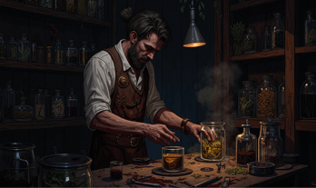</td>
</tr>
<tr>
<td>
Healer
</td>
<td>
Gold
</td>
</tr>
<tr>
<td colspan="2">
The Healer's tent is a sanctuary of herbs, bandages, and whispered incantations. Here, the wounded find respite and Permanent Wounds can be mended — for a price.
</td>
</tr>
<tr>
<td>
Heal Minor Wound
</td>
<td>
20
</td>
</tr>
<tr>
<td colspan="2">
Remove one Permanent Wound from a model.
</td>
</tr>
<tr>
<td>
Full Recovery
</td>
<td>
40
</td>
</tr>
<tr>
<td colspan="2">
Remove all Permanent Wounds from a model. That model cannot participate in the next mission.
</td>
</tr>
</tbody>
</table>

- The Healer's services are the primary way to remove Permanent Wounds from your models. Without treatment, these injuries will hinder your warband throughout the campaign.

<table>
<tbody>
<tr>
<td colspan="2">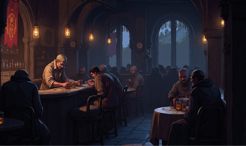</td>
</tr>
<tr>
<td>
Tavern
</td>
<td>
Gold
</td>
</tr>
<tr>
<td colspan="2">
The tavern serves as the heart of the camp—a place where warriors drink, gamble, and hear rumors of battles to come.
</td>
</tr>
<tr>
<td>
Recruitment
</td>
<td>
-
</td>
</tr>
<tr>
<td colspan="2">
Add a new model to your warband. 1 Gold equals 1 Point.
</td>
</tr>
<tr>
<td>
Rest
</td>
<td>
10
</td>
</tr>
<tr>
<td colspan="2">
Roll a D6. On a 4+, remove one Permanent Wound from the model through natural recovery.
</td>
</tr>
<tr>
<td>
Gamble
</td>
<td>
20
</td>
</tr>
<tr>
<td colspan="2">
Roll a D6: 1: lose your stake · 2: 5 Gold · 3: 10 Gold · 4: 20 Gold · 5: 30 Gold · 6: 50 Gold
</td>
</tr>
<tr>
<td>
Gossip
</td>
<td>
10
</td>
</tr>
<tr>
<td colspan="2">
Roll a D6. On a 5+, you may choose a second Side Quest before the next mission.
</td>
</tr>
<tr>
<td>
Buy Alcohol
</td>
<td>
11
</td>
</tr>
<tr>
<td colspan="2">
Grants the special rules Fearless and Resilient until the end of the game. Remove after use.
</td>
</tr>
</tbody>
</table>

Each model may use one service at Standard Locations.

#### Merchants

Not all merchants are present in the Hub after every battle. Roll 1D6 to determine which Vendors & Artisans are available:

| D6  | Available Merchant          |
|-----|-----------------------------|
| 1   | Alchemist                   |
| 2   | Enchanter                   |
| 3   | Ye Olde Shoppe              |
| 4   | Temple                      |
| 5   | Blacksmith                  |
| 6   | All merchants are available |

A maximum of 2 models per warband may purchase items or services from merchants.

Merchants offer Equipment for purchase. See the complete list of all available Equipment on page 57.

Equipment purchased from vendors is added to the model immediately and remains with the model for the duration of the campaign unless otherwise noted.

<table>
<tbody>
<tr>
<td colspan="2">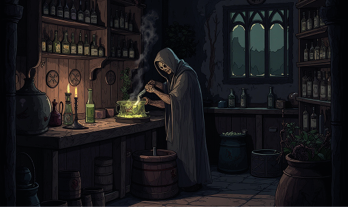</td>
</tr>
<tr>
<td>
Alchemist
</td>
<td>
Gold
</td>
</tr>
<tr>
<td colspan="2">
In his cluttered workshop, the alchemist held a vial up to the light, the liquid inside swirling like molten gold. “One drop could grant eternal life,” he whispered, but his trembling hands betrayed the truth—he had never dared to test it.
</td>
</tr>
<tr>
<td>
Buy Poison
</td>
<td>
10
</td>
</tr>
<tr>
<td colspan="2">
The weapons of the model gain the Poison special rule.
</td>
</tr>
<tr>
<td>
Buy Fire Bomb
</td>
<td>
13
</td>
</tr>
<tr>
<td colspan="2">
Counts as a Ranged Weapon: RNG 6″, ATK 4, HTV 4+, DMG 3, CRT 4 Blast, Limited
</td>
</tr>
<tr>
<td>
Buy Flash Powder
</td>
<td>
3
</td>
</tr>
<tr>
<td colspan="2">
Reduces the AP cost for the FALL BACK action to 1.
</td>
</tr>
<tr>
<td>
Buy Magic Mushrooms
</td>
<td>
17
</td>
</tr>
<tr>
<td colspan="2">
This model may perform the special action OVEREXERTION until the end of the game. Remove after use.
</td>
</tr>
<tr>
<td>
Buy Healing Potion
</td>
<td>
12
</td>
</tr>
<tr>
<td colspan="2">
Select a friendly model within 1″. That model regains 2D6 lost Wounds. If this healing fully restores the model’s VIT to its original value, any existing Injury effects are also removed.
</td>
</tr>
</tbody>
</table>

<table>
<tbody>
<tr>
<td colspan="2">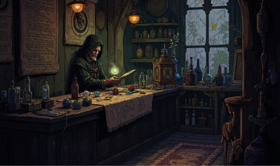</td>
</tr>
<tr>
<td>
Enchanter
</td>
<td>
Gold
</td>
</tr>
<tr>
<td colspan="2">
With a flick of his hand, glowing runes appeared in the air, swirling in intricate patterns. As the final symbol faded, the blade on the table hummed with dark energy. “It's ready,” he whispered, though the cost of such power lingered heavy in the air.
</td>
</tr>
<tr>
<td>
Buy Magic Scroll of Healing
</td>
<td>
10
</td>
</tr>
<tr>
<td colspan="2">
This model may perform the special action HEAL once. Remove after use.
</td>
</tr>
<tr>
<td>
Buy Boots of Flying
</td>
<td>
12
</td>
</tr>
<tr>
<td colspan="2">
Grants the special rule Fly.
</td>
</tr>
<tr>
<td>
Buy Magic Scroll of Reanimation
</td>
<td>
23
</td>
</tr>
<tr>
<td colspan="2">
Grants the special action Cast a Spell with the ability Reanimate the Dead: Any defeated model within 8″ can be revived as a Zombie with its original weapons: MOV 4″, DEF 3, SAV 6+, VIT 8; Resilient, Slow, Necrotic Hunger. Usable once per game.
</td>
</tr>
<tr>
<td>
Buy Spectral Band
</td>
<td>
7
</td>
</tr>
<tr>
<td colspan="2">
Grants the Spectral special rule.
</td>
</tr>
<tr>
<td>
Buy Magic Scroll of Cursed Souls
</td>
<td>
6
</td>
</tr>
<tr>
<td colspan="2">
Select one enemy model. That model immediately gains the status effect Cursed. Remove after use.
</td>
</tr>
<tr>
<td>
Buy Magic Scroll of Resurrection
</td>
<td>
25
</td>
</tr>
<tr>
<td colspan="2">
Grants the special action Cast a Spell with the ability Resurrection: This model may choose a friendly model that is Defeated. On a roll of 4+, the model returns to life with half its VIT value. Remove after use.
</td>
</tr>
</tbody>
</table>

<table>
<tbody>
<tr>
<td>
Ye Olde Shoppe
</td>
<td>
Gold
</td>
</tr>
<tr>
<td colspan="2">
In the dimly lit shop, shelves overflowed with strange trinkets and forgotten relics. The shopkeeper watched silently as customers browsed, knowing that some items carried more than just a price—they carried stories best left untold.
</td>
</tr>
<tr>
<td>
Buy Grappling Hook
</td>
<td>
6
</td>
</tr>
<tr>
<td colspan="2">
This model can climb or drop without spending movement or suffering penalties. It may also climb even without climbing aids.
</td>
</tr>
<tr>
<td>
Buy Lucky Charm
</td>
<td>
8
</td>
</tr>
<tr>
<td colspan="2">
This model gains 1 Reroll per turn.
</td>
</tr>
<tr>
<td>
Buy Net
</td>
<td>
5
</td>
</tr>
<tr>
<td colspan="2">
Opponents in Close Combat cannot use the FALL BACK action.
</td>
</tr>
<tr>
<td>
Buy Spy Glass
</td>
<td>
5
</td>
</tr>
<tr>
<td colspan="2">
When making a Ranged Attack, the target does not benefit from Cover.
</td>
</tr>
<tr>
<td>
Buy Telescope
</td>
<td>
8
</td>
</tr>
<tr>
<td colspan="2">
Improve the HTV by 1 for all ranged attacks made by this model.
</td>
</tr>
</tbody>
</table>

<table>
<tbody>
<tr>
<td colspan="2">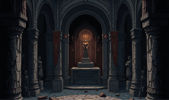</td>
</tr>
<tr>
<td>
Temple
</td>
<td>
Gold
</td>
</tr>
<tr>
<td colspan="2">
Tucked between narrow streets, the small temple stood as a quiet refuge in the bustling city. Its candles burned day and night, though few dared enter—rumors claimed the gods within listened too closely to those who prayed.
</td>
</tr>
<tr>
<td>
Buy Amulet of Protection
</td>
<td>
12
</td>
</tr>
<tr>
<td colspan="2">
Grants the special rule Protected.
</td>
</tr>
<tr>
<td>
Blessing
</td>
<td>
15
</td>
</tr>
<tr>
<td colspan="2">
Get 1 extra Fate Die for the next played scenario.
</td>
</tr>
<tr>
<td>
Prayer
</td>
<td>
10
</td>
</tr>
<tr>
<td colspan="2">
Roll a D6. On a 4+ you can remove 1 Permanent Wound from a model.
</td>
</tr>
<tr>
<td>
Buy Blessed water
</td>
<td>
4
</td>
</tr>
<tr>
<td colspan="2">
This model may use the special action CLEANSE. Remove after use.
</td>
</tr>
<tr>
<td>
Buy Idol of the Gods
</td>
<td>
15
</td>
</tr>
<tr>
<td colspan="2">
Generates 1 additional Fate Die per turn.
</td>
</tr>
</tbody>
</table>

<table>
<tbody>
<tr>
<td colspan="2">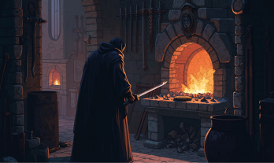</td>
</tr>
<tr>
<td>
Blacksmith
</td>
<td>
Gold
</td>
</tr>
<tr>
<td colspan="2">
The forge blazed as hammer struck metal, each blow ringing out with purpose. Sparks flew, casting shadows on the walls, but the true magic lay in the smith's hands—shaping weapons that would decide the fate of empires.
</td>
</tr>
<tr>
<td>
Weapon Upgrade
</td>
<td>
30
</td>
</tr>
<tr>
<td colspan="2">
Improve the HTV of one of the model's weapons by 1. Can only be used once per weapon.
</td>
</tr>
<tr>
<td>
Armor Upgrade
</td>
<td>
25
</td>
</tr>
<tr>
<td colspan="2">
Level up the SAV value of a model by 1. Can only be used once per model.
</td>
</tr>
<tr>
<td>
Buy Shield
</td>
<td>
7
</td>
</tr>
<tr>
<td>
Buy Sword
</td>
<td>
12
</td>
</tr>
<tr>
<td>
Buy Spear
</td>
<td>
12
</td>
</tr>
<tr>
<td>
Buy Crossbow
</td>
<td>
19
</td>
</tr>
<tr>
<td>
Buy Blunderbuss
</td>
<td>
18
</td>
</tr>
<tr>
<td>
Buy Handgun
</td>
<td>
24
</td>
</tr>
</tbody>
</table>

#### Trainers

Not all trainers are present after every battle. Roll 1D6 to determine which Trainers are available:

| D6  | Available Trainer        |
|-----|--------------------------|
| 1   | Marksman                 |
| 2   | Gladiator                |
| 3   | Magus                    |
| 4   | Old Sage                 |
| 5   | Rogue                    |
| 6   | Choose two from the list |

Trainers teach Traits that enhance a model's capabilities. A complete list of all available Traits and their effects can be found on page XX.

Newly learned Traits are permanent and count toward a model's maximum of 5 Traits. A model cannot learn a Trait it already possesses or exceed the 5 Trait limit.

Each available Trainer may train only one model per warband during the After Battle Sequence. If multiple trainers are available, different models may be trained by different trainers.

- Example: If both the Marksman and Old Sage are available (rolled a 6), one model may learn a trait from the Marksman and a different model may learn a trait from the Old Sage.

<table>
<tbody>
<tr>
<td colspan="2">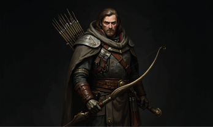</td>
</tr>
<tr>
<td>
Marksman
</td>
<td>
Gold
</td>
</tr>
<tr>
<td colspan="2">
The seasoned marksman notched an arrow, his gaze fixed on the distant target. "Precision is everything," he murmured to his students, releasing the arrow in one smooth motion. It struck dead center—proof that a steady hand and sharper mind won every battle.
</td>
</tr>
<tr>
<td>
Learn Gunslinger
</td>
<td>
8
</td>
</tr>
<tr>
<td colspan="2">
When this model performs QUICK SHOT, ignore the HTV penalty.
</td>
</tr>
<tr>
<td>
Learn Hunter
</td>
<td>
6
</td>
</tr>
<tr>
<td colspan="2">
May use SHOOT (including QUICK SHOT) twice per activation.
</td>
</tr>
<tr>
<td>
Learn Sniper
</td>
<td>
14
</td>
</tr>
<tr>
<td colspan="2">
May target enemies engaged in Melee without applying the Shoot into Combat disadvantage of potentially hitting a friendly model. May also use the TAKE AIM action. Has no Effective Range penalty.
</td>
</tr>
<tr>
<td>
Learn Hawkeye
</td>
<td>
4
</td>
</tr>
<tr>
<td colspan="2">
Ranged attack rolls of 5+ are critical successes.
</td>
</tr>
</tbody>
</table>

<table>
<tbody>
<tr>
<td colspan="2">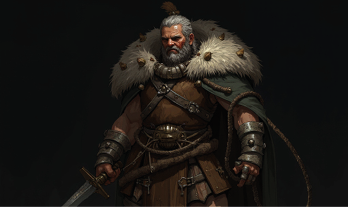</td>
</tr>
<tr>
<td>
Gladiator
</td>
<td>
Gold
</td>
</tr>
<tr>
<td colspan="2">
The blade stopped an inch from his student's throat, steady and unshaken. "Strength means nothing without control," the master growled, lowering his weapon. "Survive the first strike, and the battle is already half won."
</td>
</tr>
<tr>
<td>
Learn Furious
</td>
<td>
5
</td>
</tr>
<tr>
<td colspan="2">
May perform the FIGHT action twice per activation.
</td>
</tr>
<tr>
<td>
Learn Relentless
</td>
<td>
13
</td>
</tr>
<tr>
<td colspan="2">
May re-roll all Attack Dice once per Close Combat. 
</td>
</tr>
<tr>
<td>
Learn Guard
</td>
<td>
6
</td>
</tr>
<tr>
<td colspan="2">
Any or all Block Dice may be re-rolled once.
</td>
</tr>
<tr>
<td>
Learn Taunt
</td>
<td>
6
</td>
</tr>
<tr>
<td colspan="2">
Grants the special action TAUNT (1 ACT): choose an enemy model within 8″. In its next activation that model must attack this model if it can (SHOOT, including Quick Shot, or CHARGE); if it cannot, it must move towards this model.
</td>
</tr>
</tbody>
</table>

<table>
<tbody>
<tr>
<td colspan="2">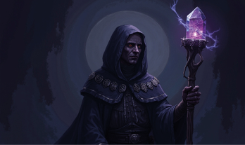</td>
</tr>
<tr>
<td>
Magus
</td>
<td>
Gold
</td>
</tr>
<tr>
<td colspan="2">
Cloaked in swirling robes, they raised a hand, drawing energy from the very air. The atmosphere crackled as ancient magic surged through their veins, bending reality itself to their silent command.
</td>
</tr>
<tr>
<td>
Learn Archmage
</td>
<td>
18
</td>
</tr>
<tr>
<td colspan="2">
May cast multiple spells per turn using the CAST A SPELL action.
</td>
</tr>
<tr>
<td>
Learn Conduit
</td>
<td>
18
</td>
</tr>
<tr>
<td colspan="2">
Rolls of 1 when generating Arcane Energy do not cause damage.
</td>
</tr>
<tr>
<td>
Learn Channeler
</td>
<td>
7
</td>
</tr>
<tr>
<td colspan="2">
Roll 3D6 instead of 2D6 when generating Arcane Energy.
</td>
</tr>
<tr>
<td>
Learn Teleport
</td>
<td>
9
</td>
</tr>
<tr>
<td colspan="2">
Use the MOVE action to move the model up to 3× its MOV in a straight line to a position it can see. Ignore all obstacles and terrain in between. Counts as a CHARGE action if the movement ends in Base Contact of an enemy model.
</td>
</tr>
</tbody>
</table>

<table>
<tbody>
<tr>
<td colspan="2">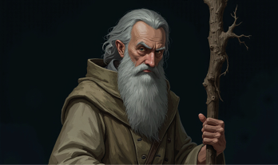</td>
</tr>
<tr>
<td>
Old Sage
</td>
<td>
Gold
</td>
</tr>
<tr>
<td colspan="2">
The elder gazed into the flickering flames, his face etched with years of knowledge. "Truth is not found in answers, but in the questions you ask," he said quietly. "Seek not the end of your journey, but the lessons along the way."
</td>
</tr>
<tr>
<td>
Learn Balanced
</td>
<td>
2
</td>
</tr>
<tr>
<td colspan="2">
Once per combat, you may reroll one Attack Die in Close Combat.
</td>
</tr>
<tr>
<td>
Learn Hero
</td>
<td>
5
</td>
</tr>
<tr>
<td colspan="2">
May use the OVEREXERTION action.
</td>
</tr>
<tr>
<td>
Learn Resilient
</td>
<td>
8
</td>
</tr>
<tr>
<td colspan="2">
Unaffected by Fearful and Critical Injuries.
</td>
</tr>
<tr>
<td>
Learn Reveal
</td>
<td>
6
</td>
</tr>
<tr>
<td colspan="2">
All Hidden enemy models within 6" of this model are immediately revealed and can be targeted.
</td>
</tr>
<tr>
<td>
Learn Mastery
</td>
<td>
9
</td>
</tr>
<tr>
<td colspan="2">
If you score at least one critical success in an Attack Roll, roll 1 additional Attack Die immediately. This die is resolved as part of the same attack sequence.
</td>
</tr>
</tbody>
</table>

<table>
<tbody>
<tr>
<td colspan="2">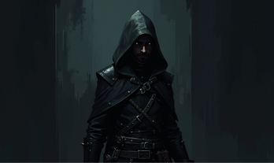</td>
</tr>
<tr>
<td>
Rouge
</td>
<td>
Gold
</td>
</tr>
<tr>
<td colspan="2">
In the shadows of the candlelit room, he laid out a series of coded messages. "Information is the deadliest weapon," he whispered to his apprentice. "Move unseen, speak little, and know everything—only then can you control the game without ever being noticed."
</td>
</tr>
<tr>
<td>
Learn Ambush
</td>
<td>
4
</td>
</tr>
<tr>
<td colspan="2">
This model starts the game in reserve. At any turn after the first, deploy it anywhere, at least 9" from any enemy model.
</td>
</tr>
<tr>
<td>
Learn Scout
</td>
<td>
6
</td>
</tr>
<tr>
<td colspan="2">
This model is deployed after all other models have been placed. Immediately after deployment, it may make a free move of up to 2× its MOV.
</td>
</tr>
<tr>
<td>
Learn Silent
</td>
<td>
4
</td>
</tr>
<tr>
<td colspan="2">
May perform HIDE and SHOOT in the same activation.
</td>
</tr>
<tr>
<td>
Learn Stealth
</td>
<td>
4
</td>
</tr>
<tr>
<td colspan="2">
Considered in Cover if at least a part of its volume is obscured by a terrain feature.
</td>
</tr>
<tr>
<td>
Learn Strider
</td>
<td>
6
</td>
</tr>
<tr>
<td colspan="2">
Ignores the effects of Difficult or Dangerous terrain.
</td>
</tr>
<tr>
<td>
Learn Swift
</td>
<td>
3
</td>
</tr>
<tr>
<td colspan="2">
Ignore climbing movement penalty.
</td>
</tr>
</tbody>
</table>

#### Faction-Specific Activities

Certain factions have access to unique locations and services. These are always available in addition to standard locations.

Refer to your faction's rules section for available services, costs, and effects.

