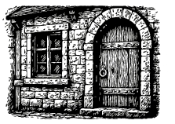
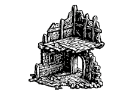
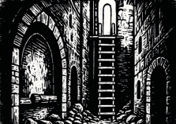
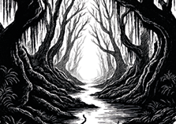
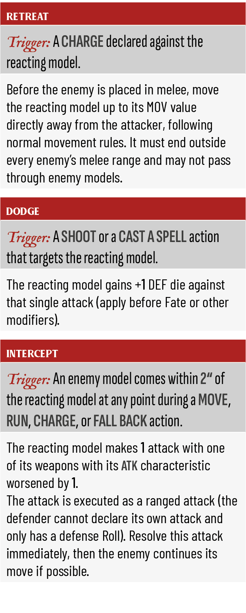

# Game Rules

## Setup

Unless another mission is agreed upon, use the Mission - Encounter on page 38.

- Roll-off: Winner chooses either to be the Defender or the Attacker. The other player takes the remaining role.
- Set up the Game Area by placing terrain and objectives as described in the mission rules.
- Deploy your models alternatingly, starting with the Defender.
- The goal of the game is to achieve the most Victory Points (VP).

Before starting a game, agree on a total point limit with your opponent, see Suggested Warband Sizes on page 14.

### Missions

There are several different missions available, each offering unique objectives and scoring conditions see Missions on page 40. The standard mission Encounter serves as the primary example described in this rulebook. If players decide to use a different mission, other rules may apply.

### Game Area

There are two ways to set up the Game Area:

Classic Setup: Perform a Roll-off. The winner chooses to either place terrain and objectives (becoming the Defender) or select a deployment zone (becoming the Attacker). The other player takes the remaining role.

Alternating Setup: Both players roll off to determine their deployment zones first. Then, they take turns placing terrain and objectives until setup is complete.

Use the method best suited to your chosen mission or group preference.

### Deployment Zone

The Deployment Zone defines the area where each player sets up their models before the game begins. Its size and position may vary depending on the chosen mission. In the standard Encounter scenario, deployment zones are placed on opposite sides of the battlefield at least 18 inches apart. Players deploy their models within their designated zone during setup.

### Terrain

For an engaging and tactical game, we recommend using a mix of large and small terrain pieces to create varied lines of sight, movement paths, and cover opportunities.

Players have to agree upon the type of each used terrain piece before placing the terrain on the Game Area. See the Terrain on page 36.

### Objectives

Objectives are a points of interest rewarding Victory Points according to the Mission rules.

For the Mission Encounter the following applies:

After setting up the terrain, the Defender rolls D3+2 to determine the number of Objective Markers. The Defender then randomly places them on the battlefield, ensuring each is at least 8“ apart and not within any Deployment Zone. These markers represent key locations that can be controlled for Victory Points or optionally looted for equipment.

### Looting Objectives

Looting is optional and can be performed on a Loot Site. A model must be within 1“ of the Loot Site and use the Interact action to attempt looting. When looting, roll on the Equipment Table on page 57 to see what item, if any, is found. Each Loot Site may be looted only once per model.

- Looting comes with a small risk—rolling an 11 on the Equipment Table triggers a trap!

### Scoring

Earn Victory Points (VP) based on mission goals, such as:

- Controlling objectives
- Defeating enemy models
- Completing Side Quests on page 19
- Specific mission objectives

The player with the most VP at game end of the game wins.

##### Controlling Objectives

At the end of each round, players are awarded Victory Points (VP) based on how many models they have near each objective:

- 1 VP for each objective you control (any model within 2“ and in LOS).
- +1 VP if you have more models at that objective than your opponent.

<!-- -->

- To control an objective, a model must be within 2“ of it and have uninterrupted line of sight to the marker.

##### Defeating enemy models

Additionally, each player scores VP for every enemy model defeated this turn that remains Defeated at the end of the round.

- 2 VP for a defeated enemy model.

### Tags 

Missions may include Tags that define how to play them in a Campaign or that normal Rules do not apply. The following Tags are available:

- Base - Normal Mission can be played any time
- Territory - Missions that are available for Territory games in Conquest Campaigns
- Stronghold - Missions that are available for Stronghold games in Conquest Campaigns
- Special - Missions that offer different play types with special rules; cannot be chosen for Campaign play.

All Missions can be chosen for a Quick Game.  

## Turns

A standard battle consists of 4 turns, with a 5th turn possible under special conditions.

Each turn follows this structure:

### 1 . Initiative Phase

Both players roll a D6. The higher result gains initiative for the turn. In case of a tie, roll again.

##### Overtime:

A 5th turn starts if one of the players has at least 5 VP less than his opponent.

### 2. Fate Phase

Each player rolls a number of Fate Dice based on their faction’s Fate Modifiers.

Fate Dice can be spent during the Action Phase.

##### Against the Odds:

If your Warband’s total point cost is at least 20 points lower than your opponent’s, gain +1 Fate Die each turn.

### 3. Action Phase

Players take turns activating ready models, beginning with the player who has initiative.

- A model may perform actions by spending its Action Points (AP).
- After using all AP or using the Pass action, the model is no longer ready.
- Players alternate activating models until none remain ready.
- If one player has no more ready models, the opposing player may activate all of their remaining ready models one after another.

##### Group Activation:

Models with the Group or Large Group traits may be activated consecutively before the opponent activates their next model.

##### Outnumbered:

At the start of the turn, if your warband has at least 2 models less than your opponent, you gain 1 free Overwatch action for every 2 models less (rounded down).

- This free Overwatch action may be used by any model, even if it has already been activated this turn.

##### Reactions:

Only models that are currently in Overwatch may react when an enemy action is declared (e.g. dodging a shot or intercepting a nearby movement).  
Reactions are resolved before the enemy action and do not cost AP (the AP was paid when the model entered Overwatch).

See Reactions on page 19 for all rules and triggers.

### 4. End Phase

- The turn ends when no ready models remain.
- Unused Fate Dice expire.
- Score VP as described by the active mission.

<!-- -->

- Use tokens or flip cards to track model activation status.

## Actions

Unless specified otherwise, a model may not perform the same action more than once per activation.

The following actions are available to all models:

| Pass - 1 AP |
|----|
| No effect. Can be used multiple times in the same activation to end a model‘s turn early. |

| MOVE - 1 AP |
|----|
| Move the model up to its MOV value in inches. It may not move through other models, impassable terrain or into Melee Range of enemies. |
| Cannot be used while within Melee Range of an enemy model. |

<table>
<thead>
<tr>
<th scope="col">
Run - 2 AP
</th>
</tr>
</thead>
<tbody>
<tr>
<td>
Move up to twice the model’s MOV value. It may not move through other models, impassable terrain or into Melee Range of enemies. 
Counts as a MOVE action.
</td>
</tr>
<tr>
<td>
Cannot be used while within Melee Range of an enemy model or in the same activation as Move, CHARGE or FALL BACK.
</td>
</tr>
</tbody>
</table>

<table>
<thead>
<tr>
<th scope="col">
Charge - 1 AP
</th>
</tr>
</thead>
<tbody>
<tr>
<td>
Move up to MOV +2“. Must end the move within Melee Range of an enemy model. Attacker gets +1 ATK in the following Close Combat. 
Jumping down from a height (within 3“) grants +1 Critical Hit in the following fight.
</td>
</tr>
<tr>
<td>
Cannot be used while already in Melee Range or during the same activation as MOVE, FALL BACK, or HIDE.
</td>
</tr>
</tbody>
</table>

| Fight - 1 AP                                             |
|----------------------------------------------------------|
| Engage in Close Combat as the Attacker.                  |
| Can only be used while in Melee Range of an enemy model. |

| Shoot - 1 AP |
|----|
| Make a Ranged Attack with one of the model‘s ranged weapons. |
| Cannot be used while in Melee Range or in the same activation as MOVE, Run or HIDE. |

<table>
<thead>
<tr>
<th scope="col">
Fall back - 2 AP
</th>
</tr>
</thead>
<tbody>
<tr>
<td>
Move as a normal MOVE but may pass through Melee Range of enemies. 
Must not end within Melee Range.
</td>
</tr>
<tr>
<td>
Only usable while already in Melee Range. Cannot be used in the same activation as MOVE or CHARGE.
</td>
</tr>
</tbody>
</table>

| Recover - 1 AP                                                |
|---------------------------------------------------------------|
| Remove the status effects: Burning, Fearful, Stunned, Frozen. |
| Cannot be used while in Melee Range unless otherwise stated.  |

<table>
<thead>
<tr>
<th scope="col">
Overwatch - 1 AP
</th>
</tr>
</thead>
<tbody>
<tr>
<td>
Place the model on Overwatch. While on Overwatch, it may declare one Reaction.

Overwatch ends as soon as that Reaction has been resolved or when the model is next activated – whichever happens first.
</td>
</tr>
</tbody>
</table>

| Hide - 1 AP |
|----|
| If in Cover and out of Line of Sight, the model becomes Hidden. |
| Cannot be used while in Melee Range or during the same activation as SHOOT or CHARGE. |

<table>
<thead>
<tr>
<th scope="col">
Interact - 1 AP
</th>
</tr>
</thead>
<tbody>
<tr>
<td>
Interact with an Objective, Weapon or Entryway.

Must be within 1“ of the object.

Can be used multiple times in the same activation.
</td>
</tr>
<tr>
<td>
Cannot be used while in Melee Range unless otherwise stated.
</td>
</tr>
</tbody>
</table>

### Interact special Rules

Reloading Black Powder Weapons  
After firing a Black Powder weapon (whether the shot succeeds, fails, or misfires), the weapon must be reloaded:

Use the INTERACT action while not in Melee Range

The weapon cannot be fired again until reloaded  
Some weapons or equipment may modify reload requirements

### Looting

When a model is in base contact with a Loot Site, it may spend one action to Interact with it in order to loot the object.

- A Loot Site can be looted once per game. Roll on the Equipment on page 64 to determine which item is found.
- In the standard Encounter mission, all Objectives count as Loot Sites. Other missions may specify additional or alternative Loot Sites in their mission briefing.

<!-- -->

- Equipment cards can be printed and placed next to your model card for easier tracking and quick reference during play.

## Special Actions

Special actions can only be performed if granted by Traits, faction abilities, or equipment.

Unless otherwise stated, a model cannot perform the same special action more than once per activation.

Special actions count as actions.

<table>
<thead>
<tr>
<th scope="col">
Guard - 1 AP
</th>
</tr>
</thead>
<tbody>
<tr>
<td>
Gain 1 additional Block Die in the next Close Combat this turn. 
This Block Die succeeds on the weapon's HTV value, critical on 6.
</td>
</tr>
<tr>
<td>
Cannot be chosen if the model already fought during this activation.
</td>
</tr>
</tbody>
</table>

<table>
<thead>
<tr>
<th scope="col">
Overexertion - 1 AP
</th>
</tr>
</thead>
<tbody>
<tr>
<td>
Gain +2 AP this turn. The model may use Shoot or Fight actions twice. 
Next turn, the model can only use Hide, Recover or PASS.
</td>
</tr>
</tbody>
</table>

<table>
<thead>
<tr>
<th scope="col">
Cleanse - 1 AP
</th>
</tr>
</thead>
<tbody>
<tr>
<td>
Select a friendly model within 1“ (the acting model may target itself).

Remove any of the following status effects:

Burning, Cursed, Poisoned, Fearful, Stunned, Frozen.
</td>
</tr>
<tr>
<td>
Cannot be used while within Melee Range of an enemy model.
</td>
</tr>
</tbody>
</table>

<table>
<thead>
<tr>
<th scope="col">
Heal - 1 AP
</th>
</tr>
</thead>
<tbody>
<tr>
<td>
Select a friendly model within 1“. That model regains 2D3 lost Wounds and the Poisoned status is removed.

If this healing fully restores the model’s WND to its original value, any existing Injury effects are also removed.
</td>
</tr>
<tr>
<td>
Cannot be used while within Melee Range of an enemy model.
</td>
</tr>
</tbody>
</table>

| Take Aim - 1 AP |
|----|
| The HTV for the next Ranged Attack will be improved by 1. |
| Cannot be used while in Melee Range or in the same activation as Run or HIDE. |

<table>
<thead>
<tr>
<th scope="col">
Cast a spell - 1 AP
</th>
</tr>
</thead>
<tbody>
<tr>
<td>
Roll 2D6 to generate Arcane Energy. Cast a spell from your Warband’s Arcane Lore with equal or lower cost.

Each 1 rolled causes 2 Fatal Damage.

Magic Scrolls may be cast without rolling for Arcane Energy.
</td>
</tr>
</tbody>
</table>

| Invocation - 1 AP |
|----|
| Roll 2D6 to generate Divine Energy. Invoke a power from your Warband’s Divine Lore with equal or lower cost. |

| Command - 1 AP |
|----|
| Choose one friendly model within 12“. It gains +1 AP until the end of its next activation. |

| Raise Shield - 1 AP |
|----|
| Until the start of the model's next activation, it counts as being in Cover against Ranged Attacks. |
| Cannot be used while within Melee Range of an enemy model. |

| QUICK SHOT - 1 AP |
|----|
| Make a Ranged Attack with HTV worsened by 1 (minimum 6+) |
| Cannot be used while in Melee Range or in the same activation as Run or HIDE. |

## Reactions

Sometimes a warrior’s reflexes are faster than any plan. A model that has taken the Overwatch action can interrupt an opponent’s move the instant it happens.

Reactions count as an Action.

##### When can I react? - Reaction triggers

1.  The enemy model declares an action.
2.  Before any dice are rolled, any friendly model that is on Overwatch and meets a trigger below may declare one Reaction.
3.  Resolve the Reaction immediately, then finish resolving the enemy action.

##### Reaction Rules

- The reacting model must be on Overwatch; models not on Overwatch cannot react.
- Overwatch ends after the Reaction is resolved or when the model is next activated, whichever comes first.
- The model must not be Stunned, Frozen, or Defeated.
- One Reaction per enemy action; Reactions never trigger further Reactions.
- Reactions cost no AP (the AP was paid when Overwatch was declared).
- All usual rules for Line of Sight, Cover and weapon restrictions apply.

<!-- -->

- Reactions introduce snap-decisions and positional play - keep an eye on your remaining AP and your opponent’s next move!

| Retreat |
|----|
| Trigger: A CHARGE declared against the reacting model. |
| This model immediately moves D3+1" directly away from the charging enemy model, following normal movement rules. It must end outside every enemy’s melee range and may not pass through enemy models. If the final distance exceeds the charging model's remaining movement, this model is no longer in melee range and the CHARGE fails. The charging model ends its movement at its maximum range toward the target. |

| Dodge |
|----|
| Trigger: A SHOOT or a CAST A SPELL action that targets the reacting model. |
| The reacting model gains +1 DEF die against that single attack (apply before Fate or other modifiers). |

<table>
<thead>
<tr>
<th scope="col">
Intercept
</th>
</tr>
</thead>
<tbody>
<tr>
<td>
Trigger: An enemy model moves within 2“ of the reacting model at any point during a MOVE, RUN, CHARGE, or FALL BACK action.
</td>
</tr>
<tr>
<td>
The reacting model makes 1 attack with one of its weapons with its ATK characteristic worsened by 1.

The attack is executed as a ranged attack (the defender cannot declare its own attack and only has a defense Roll). Resolve this attack immediately, then the enemy continues its move if possible.
</td>
</tr>
</tbody>
</table>

<table>
<thead>
<tr>
<th scope="col">
Reaction Shot
</th>
</tr>
</thead>
<tbody>
<tr>
<td>
Trigger: An enemy model comes within 8“ of the reacting model at any point during a MOVE, RUN, CHARGE, or FALL BACK action.
</td>
</tr>
<tr>
<td>
Make a Ranged Attack against the triggering enemy model with the following modifiers:

- Reduce ATK by 1 (minimum 1)

- Worsen HTV by 1 (minimum 6+)
</td>
</tr>
</tbody>
</table>

## Sight & Targeting

To perform certain actions such as ranged attacks, a model must be able to see its target.

### Line of Sight

A model is considered within Line of Sight (LoS) of a target if:

1.  The target is at least partially visible.
2.  The target is not Hidden.

Models have a 360° field of view and may see through friendly models.

### Visibility

To determine visibility, look from behind the attacking model. If you can trace a clear, unobstructed line from its head to any part of the target’s body, the target is visible.

### Cover

A model is in Cover if the following conditions are met:

- It is within 1“ of a terrain feature (small or large),
- The majority of its volume is obscured by that feature from the attacker‘s perspective.

Cover provides defensive advantages. However, models within 2“ of an attacker cannot benefit from Cover due to close proximity.

- Use the base size of a model as the reference for determining Line of Sight and Cover. Ignore decorative elements or overhanging parts of the miniature.

##### Defense Bonus

A model in Cover may retain 1 Defense Die as a successful normal save during ranged attacks without rolling it.

##### Hidden

If a model in Cover performs the Hide action, it is considered hidden and cannot be targeted by enemies outside of melee range.

The model stays hidden until it moves or performs an action that is not compatible with HIDE.

- Hidden models can control objectives.

Model is in LoS and has no cover, because it is only partially obscured.

Model is in LoS and has cover, because the majority of it is obscured.

No LoS because the model is in cover and hidden.

## Movement

There are different types of movement that may alter the total distance a model can travel or the way it interacts with terrain and other models. Unless stated otherwise, a model may move a number of inches equal to its MOV characteristic.

##### Climb

Reduce movement by 1“ to climb vertically up or down. Unless stated otherwise, a climbing aid (e.g. ladder, rope) is required to perform a Climb.

##### Jump

Jump across a gap up to half the model’s MOV. This counts as part of normal movement.

##### Traverse

Move over an obstacle smaller than the model’s height by spending 2“ of movement.

##### Drop

You may drop down up to 2“ without spending MOV.

For heights above 2“, roll a Defense die for each additional inch. On a failed roll, suffer 1 damage per failed inch.

##### Push

Use a standard Move action to push an enemy model of equal or smaller height up to 2“ away.

You must begin outside melee range and end within melee range of the target.

The target rolls a Defense die. On a failure, it is pushed. On success, treat the action as a Charge with the target as the attacker.

##### Run

Use the Run action to double the model’s MOV value for this move.

Cannot be combined with other movement types, except Jump or Push.

### Fly / Teleport

Models with the Fly or Teleport trait ignore all obstacles and terrain during movement. The model’s movement must start and end on open terrain.

### Falling

If a model falls unintentionally from a height over 2“, roll a Defense die for each inch above 2“.

Each failed roll causes 1 damage. A roll of 1 also Stuns the model.

### Meele Range

Two models are within Melee Range if their bases are within 1“ of each other.

Melee Range is required to perform Close Combat actions.

It also affects other rules and actions, such as Charge, Push, and certain Special Abilities.

### Jump Attack

When a model performs a Charge from a height of up to 3“ and enters Melee Range as part of a Drop, it gains an additional critical hit in the following Close Combat sequence.

## Terrain

Terrain shapes the battlefield and influences every move your warriors make. It affects movement, line of sight, available actions, and cover.

- Before the game begins, players must agree on the type and rules of each terrain piece used on the board. Consistent classification ensures fair and strategic gameplay.
- Walls, Buildings, Large Rocks, etc. are impassable and block Line of Sight.

| Open Terrain | Grass Fields, Roads, Open Plazas |
|----|----|
|  | No special effects. Models move normally and may be targeted without penalty. |

<table>
<thead>
<tr>
<th scope="col">
Small Objects
</th>
<th scope="col">
Barrels, Crates, Gravestones, Rubble Pile, Small Barricades
</th>
</tr>
</thead>
<tbody>
<tr>
<td></td>
<td><ul>
<li>Objects ≤ 1″ high.</li>
<li>Grants Cover.</li>
<li>Can be Traversed without movement penalty.</li>
</ul></td>
</tr>
</tbody>
</table>

<table>
<thead>
<tr>
<th scope="col">
Field Defenses
</th>
<th scope="col">
Barricades, Stone Wall Sections, Fallen Statues
</th>
</tr>
</thead>
<tbody>
<tr>
<td></td>
<td><ul>
<li>Objects smaller than the model’s height.</li>
<li>Grants Cover.</li>
<li>Can be Traversed by spending 2“ of movement.</li>
</ul></td>
</tr>
</tbody>
</table>

<table>
<thead>
<tr>
<th scope="col">
Entryways
</th>
<th scope="col">
Doors, Gates, Grills, Windows
</th>
</tr>
</thead>
<tbody>
<tr>
<td></td>
<td><ul>
<li>Passable only when unlocked.</li>
<li>Use the INTERACT action to lock or unlock.</li>
</ul></td>
</tr>
</tbody>
</table>

<table>
<thead>
<tr>
<th scope="col">
Loot Sites
</th>
<th scope="col">
Treasure Chests, Weapon Racks, Supply Crates
</th>
</tr>
</thead>
<tbody>
<tr>
<td></td>
<td>
Models within 1″ may use the Interact action to search for equipment or resources. Roll 2D6 on the Equipment Table to determine the result.

<ul>
<li>Only once per object.</li>
<li>Each mission defines which Loot Sites are available.</li>
</ul></td>
</tr>
</tbody>
</table>

<table>
<thead>
<tr>
<th scope="col">
Elevated Ground
</th>
<th scope="col">
Upper Floor, Roof, Hill, Tower, Lookout
</th>
</tr>
</thead>
<tbody>
<tr>
<td></td>
<td><ul>
<li>At least 3″ above ground level.</li>
<li>Models standing here gain access to the TAKE AIM special action.</li>
</ul></td>
</tr>
</tbody>
</table>

<table>
<thead>
<tr>
<th scope="col">
Climbing Gear
</th>
<th scope="col">
Ladders, Ropes
</th>
</tr>
</thead>
<tbody>
<tr>
<td></td>
<td><ul>
<li>Models may climb up or down by spending 1" of movement.</li>
</ul></td>
</tr>
</tbody>
</table>

<table>
<thead>
<tr>
<th scope="col">
Difficult Terrain
</th>
<th scope="col">
Woods, Shallow Waters, Mud, Ponds, Swamp, Rubble, Thick Undergrowth
</th>
</tr>
</thead>
<tbody>
<tr>
<td></td>
<td><ul>
<li>Models cannot use the RUN action while moving through this terrain.</li>
</ul></td>
</tr>
</tbody>
</table>

<table>
<thead>
<tr>
<th scope="col">
Dangerous Terrain
</th>
<th scope="col">
Deadly or Poisonous Vegetation, Quick Sand, Flames
</th>
</tr>
</thead>
<tbody>
<tr>
<td></td>
<td><ul>
<li>Models cannot use the RUN action while moving through this terrain.</li>
<li>Model takes D3 Fatal Wounds per movement action.</li>
</ul></td>
</tr>
</tbody>
</table>

## Close Combat

The model that declares a Fight action and begins this sequence in Melee Range is the Attacker; the opposing model is the Defender.

### 1. Engage

Choose one enemy model within Melee Range (1“). It becomes the Defender.

### 2. Choose Weapons

Each player picks one Close Combat weapon profile for their model (Type close).

If a model has no melee weapon, use the  
Unarmed profile.

### 3. Roll Dice

Both players roll their Attack and Block Dice (if available).

- Roll all Attack and Block Dice.
- Keep the Attack and Block Dice separate.
- A roll of 6 is always a critical success and may trigger additional rules.
- A roll of 1 is an automatic fail and may trigger additional rules.
- Dice that are not successful are removed.

##### Attack Dice

- Roll a number of D6 equal to the weapon’s ATK.
- A result ≥ HTV is a normal success.
- A 6 is a critical success.

##### Block Dice

- Any bonus dice from Armor, Shields, or other rules, that may be used for blocking.
- Each Block Die has a target value determined by its rules.
- A 6 is a critical success.

### 4. Resolve Dice

The Attacker spends one successful die first; players then alternate until every successful die has been resolved or a model is defeated.

Strike: When you spend a successful Attack Die to Strike, the Defender suffers Damage. A normal success inflicts the value of DMG; a critical success inflicts the value CRT and the model needs to roll for Critical Injuries.

Block: When you spend any successful die to Block, you cancel one of your opponent’s unresolved successful dice. A normal success cancels a normal success; a critical success cancels any success. Block dice may only be spent in this way.

- If one player runs out of successful dice, the other player resolves all remaining dice.
- A model whose wounds are reduced to 0 is Defeated and removed from the game.

### Traits

Some important Traits that affect combat.

##### Assist:

Each friendly model that is also in Melee Range of the Defender improves the Attacker’s HTV by 1 (to a minimum of 2+).

##### Unarmed:

Models without a Close Combat weapon may use the following Unarmed Profile in Close Combat, representing their fists or makeshift weapon.

| name    | RNG | ATK | htv | DMG | crt |
|---------|-----|-----|-----|-----|-----|
| Unarmed | 1“  | 2   | 5+  | 1   | 2   |

##### Buckler:

Grants +1 Block Die. Block succeeds on 5+, critical on 6.

##### Shield:

Grants +1 Block Die. Block succeeds on 4+, critical on 6.

##### Medium Armor:

Grants +1 Block Die. Block succeeds on 4+, critical on 6.

##### Heavy Armor:

Grants +1 Block Die. Block succeeds on 3+, critical on 6.

##### Cleave

If you retain at least one critical success, you may upgrade one normal success to a critical success.

##### First Strike:

During the Resolve Dice step, this model always resolves the first successful die.

Player 1 rolls 3 Attack Dice and 1 Block Die. Player 2 rolls 3 Attack Dice. The 3 and 2 are not successful and therefore ignored.  
Player 1 uses the Block Die to block the successful 5 of his enemy.  
Player 2 uses his critical success (6) to block the critical hit of Player 1.  
Player 1 uses his successful Attack Die (4) to Strike and deal damage.

## Ranged Combat

The model that declares a Shoot action is the Attacker; the chosen target is the Defender.

### 1. Select Weapon

The Attacker chooses one of the model’s ranged weapon profiles (Type range).

### 2. Acquire Target

- The Attacker selects a target in the model’s Line of Sight and within the weapon’s maximum range.
- The target needs to be at least 2" away.
- The target becomes the Defender.

### 3. Roll Attack Dice

- The Attacker rolls a number of D6 equal to the weapon’s ATK value.
- A result ≥ HTV is a normal success.
- A 6 is a critical success and may trigger additional rules.
- A roll of 1 is an automatic fail and may trigger additional rules.
- Dice that are not successful are removed.

### 4. Roll Defense Dice

- The Defender rolls a number of D6 equal to his DEF value.
- A result ≥ SAV is a normal success.
- A 6 is a critical success and may trigger additional rules.
- A roll of 1 is an automatic fail and may trigger additional rules.
- Dice that are not successful are removed.

### 5. Resolve Defense Dice

The Defender spends their successful dice first:

- Critical success: Discards one of the Attacker’s normal or critical successes.
- Normal success: Discards one normal success. Two normal successes together may discard one critical success.

After each Defense Die is spent, remove it.

### 6. Deal Damage

The Attacker resolves all remaining successful Attack Dice:

- A normal success inflicts damage equal to the weapon’s DMG value.
- A critical success inflicts damage equal to the weapon’s CRT value and the model needs to roll for Critical Injuries.

Reduce the Defender’s Wounds accordingly. A model whose Wounds are reduced to 0 is Defeated and removed from the game.

### Traits

Some important Traits and Rules that affect combat.

##### Cover

If the Defender is in Cover, they may retain one of their Defense Dice as an automatic normal success before rolling the remaining Defense Dice.

##### Shoot into Combat

If the targeted Defender is in Melee Range of a friendly model, all failed attack dice must be rerolled.

These rerolled dice are now resolved against the friendly model instead.

##### Take Aim

If a model is positioned on Elevated Terrain, it may declare the Take Aim action before shooting. See Special Actions on page 24 for details.

##### Armor Piercing / Armor Shatter

The Defender’s SAV value is worsened by 1 / 2  
(to a minimum of 6+).

##### Cleave

If you retain at least one critical success, you may upgrade one normal success to a critical success.

### Effective Range

Ranged weapons are less accurate at extreme distances.

When making a Ranged Attack against a target more than 8" away, the attacker's HTV is worsened by 1.

### Misfire Table

When a weapon with the Black Powder or Warp Tech trait requires a Misfire check, roll 1D6 and consult the table below:

| D6 | Name | Description |
|----|----|----|
| 1 | Flashback | Burning powder ignites the wielder. The wielder suffers D3 Fatal Wounds and gains the Burning status effect. |
| 2-3 | Jammed | The mechanism is fouled. Requires two INTERACT actions to clear the blockage and reload. |
| 4-6 | Minor Spark | The shot fails. May reload normally with one INTERACT action. |

## Wounds

Each model has a WND (Wounds) characteristic, representing its total health. Whenever a model suffers damage, reduce its WND accordingly.

### Fatal Damage

Fatal Damage cannot be blocked and ignores Defense throws.

### Defeated

A model is Defeated when its WND is reduced to 0 or less. Remove it from the game immediately.

### Healing

- A model can be healed, but not beyond its starting WND value.
- If a model is healed to full WND, remove any Critical Injuries it suffered during the game.

### Critical Injuries

Whenever a model suffers damage from a critical hit in close combat, roll once on the Critical Injuries Table. Apply the result at the end of the turn in which the critical damage was inflicted.

- Each injury effect lasts for the remainder of the game.
- A model can only suffer each type of critical injury once per game.
- In campaign play, roll on the Permanent Injuries Table after the mission to determine if the injury persists.

### Critical Injuries Table

| D6    | Type       | Effect |
|-------|------------|--------|
| 1     | Head       | HTV +1 |
| 2     | Arm        | ATK -1 |
| 3     | Leg        | MOV -1 |
| 4 - 6 | Fleshwound | none   |

- Use tokens or a marker to track active injuries.

##### Helmet

Ignore results of 1 (Head) on the table.

## Status Effects

Certain rules, attacks, or spells may inflict lasting conditions on a model. These are called Status Effects. Each effect alters the model’s capabilities until removed.

- Status effects remain on a model until removed by a rule or an Action.
- A model cannot be affected by the same status effect more than once.

<table>
<thead>
<tr>
<th></th>
<th scope="col">
Effect
</th>
<th scope="col">
Removed by
</th>
</tr>
</thead>
<tbody>
<tr>
<td></td>
<td>
Stunned

Can only perform RECOVER or PASS.
</td>
<td>
RECOVER 
CLEANSE
</td>
</tr>
<tr>
<td></td>
<td>
Burning

Suffers 1D3 Fatal Damage at the start of each turn.
</td>
<td>
RECOVER 
CLEANSE
</td>
</tr>
<tr>
<td></td>
<td>
Frozen

Movement is reduced by 2".
</td>
<td>
RECOVER 
CLEANSE
</td>
</tr>
<tr>
<td></td>
<td>
Fearful

Roll a D6 before using an action. On 1, the action is not performed and the AP is lost. The Pass, Move, Run, Fall Back and Hide actions are not affected.
</td>
<td>
RECOVER 
CLEANSE
</td>
</tr>
<tr>
<td></td>
<td>
Poisoned

Suffers 1 Fatal Damage at the end of each turn.
</td>
<td>
HEAL 
CLEANSE
</td>
</tr>
<tr>
<td></td>
<td>
Cursed

Rolls of 1 on any Attack or Block Dice cause 1 Fatal Damage.
</td>
<td>
CLEANSE
</td>
</tr>
<tr>
<td></td>
<td>
Head Injury

+1 to HTV (Harder to hit enemies).
</td>
<td>
100% 
HEAL
</td>
</tr>
<tr>
<td></td>
<td>
Arm Injury

–1 ATK (Fewer attack dice).
</td>
<td>
100% 
HEAL
</td>
</tr>
<tr>
<td></td>
<td>
Leg Injury

–1 MOV (Reduced movement).
</td>
<td>
100% 
HEAL
</td>
</tr>
</tbody>
</table>

## Arcane & Divine Powers

Some models may harness supernatural forces through either Arcane Magic or Divine Invocations. These powers are represented by special actions and are available only to models with the appropriate trait. All supernatural powers require energy to activate: Arcane Energy or Divine Energy.

### Arcane Magic

Models with the Arcane trait may perform the CAST A SPELL action to generate Arcane Energy and cast a spell from their Warband’s selected Arcane Lore.

##### Arcane Energy

When you cast a spell, roll 2D6 to generate Arcane Energy (AE). You may only cast a spell if its energy cost is equal to or less than the AE rolled.

- Each die that shows a result of 1 causes the caster to suffer 2 Fatal Damage.
- Arcane Energy is temporary and must be used during the action. It cannot be stored or transferred.
- Spells from Magic Scrolls may be cast without rolling for Arcane Energy.

### Divine Invocations

Models with the Divine trait may perform the INVOCATION action to call upon a power from a Divine Lore.

##### Divine Energy

When performing an Invocation, roll 2D6 to generate Divine Energy (DE). You may only invoke a power if its cost is equal to or less than the DE rolled.

- Divine Energy is temporary and must be used during the action. It does not cause harm on low rolls and cannot be stored or transferred.

### Arcane & Divine Lores

Each Warband may choose one Lore: either an Arcane Lore or a Divine Lore.

- Arcane Lores contain Spells and may only be used by models with the Arcane rule.
- Divine Lores contain Invocations and may only be used by models with the Divine rule.
- Each power may be used once per activation.
- Mixed Warbands (e.g. Mercenaries) may only choose from the following universal Lores
- Additional Lores are detailed in the respective Factions Traits.

### 

##### Lesser Magic

This Arcane Lore is available to models with the Arcane trait in all Warbands.

| Name | Description | AE |
|----|----|----|
| Fog of War | Target a friendly model within 12". That model is considered Hidden until the end of its next activation | 3 |
| Teleport | Move the caster up to 12" in a straight line to a visible position. Ignore terrain and obstacles during this move. If the destination is in Melee Range of an enemy, this counts as a Charge action. | 4 |
| Fireball | Make a ranged attack (RNG 12", ATK 3, HTV 4+, DMG 3, CRT 4). The attack has the Fire weapon rule. | 5 |
| Healing Touch | Counts as performing a HEAL action. | 5 |
| Arcane Barrier | Target a model within 12". That model gains Protected until the end of its next turn (it may retain one defence die as a normal save or block without rolling). | 6 |
| Divine Favor | Target a model within 24". That model may re-roll one upcoming dice result. The second result must be accepted. | 9 |

##### Minor Rites

This Divine Lore is available to models with the Divine trait in all Warbands.

<table>
<thead>
<tr>
<th scope="col">
Name
</th>
<th scope="col">
Description
</th>
<th scope="col">
DE
</th>
</tr>
</thead>
<tbody>
<tr>
<td>
Soothing Chant
</td>
<td>
Select a friendly model within 12“. Remove any of the following status effects:

Burning, Cursed, Poisoned, Fearful, Stunned, Frozen.
</td>
<td>
3
</td>
</tr>
<tr>
<td>
Guiding Steps
</td>
<td>
Choose a friendly model within 12". That model gains +1" MOV until the end of its next activation.
</td>
<td>
4
</td>
</tr>
<tr>
<td>
Balancing Touch
</td>
<td>
Target a friendly model within 6". Until the end of the round, it may re-roll one defense die in any defense roll.
</td>
<td>
6
</td>
</tr>
<tr>
<td>
Ritual of Endurance
</td>
<td>
Choose a friendly model within 6". It heals D3 Wounds. No additional status effects are removed.
</td>
<td>
7
</td>
</tr>
</tbody>
</table>