# Game Rules

## Setup

Unless another mission is agreed upon, use the Mission - Encounter on page 38.

- Roll-off: Winner chooses either to be the Defender or the Attacker. The other player takes the remaining role.
- Set up the Game Area by placing terrain and objectives as described in the mission rules.
- Deploy your models alternatingly, starting with the Defender.
- The goal of the game is to achieve the most Victory Points (VP).

Before starting a game, agree on a total point limit with your opponent, see Suggested Warband Sizes on page 14.

1.  Missions

There are several different missions available, each offering unique objectives and scoring conditions see Missions on page 40. The standard mission Encounter serves as the primary example described in this rulebook. If players decide to use a different mission, other rules may apply.

1.  Game Area

There are two ways to set up the Game Area:

Classic Setup: Perform a Roll-off. The winner chooses to either place terrain and objectives (becoming the Defender) or select a deployment zone (becoming the Attacker). The other player takes the remaining role.

Alternating Setup: Both players roll off to determine their deployment zones first. Then, they take turns placing terrain and objectives until setup is complete.

Use the method best suited to your chosen mission or group preference.

1.  Deployment Zone

The Deployment Zone defines the area where each player sets up their models before the game begins. Its size and position may vary depending on the chosen mission. In the standard Encounter scenario, deployment zones are placed on opposite sides of the battlefield at least 18 inches apart. Players deploy their models within their designated zone during setup.

Place your models alternatingly in your Deployment Zone, starting with the Defender.

1.  Terrain

For an engaging and tactical game, we recommend using a mix of large and small terrain pieces to create varied lines of sight, movement paths, and cover opportunities.

Players have to agree upon the type of each used terrain piece before placing the terrain on the Game Area. See the Terrain on page 38.

1.  Objectives

Objectives are a points of interest rewarding Victory Points according to the Mission rules.

For the Mission Encounter the following applies:

After setting up the terrain, the Defender rolls D3 + 1 to determine the number of Objective Markers. The Defender then randomly places them on the battlefield, ensuring each is at least 8″ apart and not within any Deployment Zone. These markers represent key locations that can be controlled for Victory Points or optionally looted for equipment.

1.  Looting Objectives

Looting is optional and can be performed on a Loot Site. A model must be within 1″ of the Loot Site and use the Interact action to attempt looting. When looting, roll on the Equipment Table on page 57 to see what item, if any, is found. Each Loot Site may be looted only once per model.

- Looting comes with a small risk—rolling an 11 on the Equipment Table triggers a trap!

1.  Scoring

Earn Victory Points (VP) based on mission goals, such as:

- Controlling objectives
- Defeating enemy models
- Completing Side Quests on page 19
- Specific mission objectives

The player with the most VP at game end of the game wins.

##### Controlling Objectives

At the end of each round, players are awarded Victory Points (VP) based on how many models they have near each objective:

- 1 VP for each objective you control (any model within 2″ and in LOS).
- +1 VP if you have more models at that objective than your opponent.

<!-- -->

- To control an objective, a model must be within 2″ of it and have uninterrupted line of sight to the marker.

##### Defeating enemy models

Additionally, each player scores VP for defeating enemy models.

- 2 VP the first time an enemy model is Defeated in this game. A model that returns to play and is Defeated again yields no further VP.

1.  Tags 

Missions may include Tags that define how to play them in a Campaign or that normal Rules do not apply. The following Tags are available:

- Base - Normal Mission can be played any time
- Territory - Missions that are available for Territory games in Conquest Campaigns
- Stronghold - Missions that are available for Stronghold games in Conquest Campaigns
- Special - Missions that offer different play types with special rules; cannot be chosen for Campaign play.

All Missions can be chosen for a Quick Game.\

## Turns

A standard battle consists of 4 turns, with a 5th turn possible under special conditions.

Each turn follows this structure:

1.  Initiative Phase

Both players roll a D6. The higher result gains initiative for the turn. In case of a tie, roll again.

##### Overtime:

A 5th turn starts if one of the players has at least 5 VP less than his opponent.

1.  Fate Phase

Each player rolls a number of Fate Dice based on their faction’s Fate Modifiers.

Fate Dice can be spent during the Action Phase.

##### Against the Odds:

If your Warband’s total point cost is at least 20 points lower than your opponent’s, gain +1 Fate Die each turn.

1.  Action Phase

Players take turns activating ready models, beginning with the player who has initiative.

- A model may perform actions by spending its Actions (ACT).
- After using all ACT or using the Pass action, the model is no longer ready.
- Players alternate activating models until none remain ready.
- If one player has no more ready models, the opposing player may activate all of their remaining ready models one after another.

##### Group Activation:

Models with the Henchmen or Swarm traits may be activated consecutively before the opponent activates their next model.

##### Outnumbered:

At the start of the turn, if your warband has at least 2 models fewer than your opponent, you gain 1 free Overwatch action for every 2 models fewer (rounded down).

- A free Overwatch may be given to any model, even one that has already been activated this turn. The restrictions of the Overwatch action apply: not while in Base Contact.

##### Reactions:

Only models that are currently in Overwatch may react when an enemy action is declared (e.g. dodging a shot or intercepting a nearby movement).\
Reactions are resolved before the enemy action and do not cost ACT (the ACT was paid when the model entered Overwatch).

See Reactions on page 19 for all rules and triggers.

1.  End Phase
    - The turn ends when no ready models remain.
    - Unused Fate Dice expire.
    - Score VP as described by the active mission.

    <!-- -->

    - Use tokens or flip cards to track model activation status.

## Actions

Unless specified otherwise, a model may not perform the same action more than once per activation.

The following actions are available to all models:

| Pass - 1 ACT |
|----|
| No effect. Can be used multiple times in the same activation to end a model‘s turn early. |

| MOVE - 1 ACT |
|----|
| Move the model up to its MOV value in inches. It may not move through other models, impassable terrain or into Base Contact with enemies. |
| Cannot be used while in Base Contact with an enemy model. |

<table>
<thead>
<tr>
<th scope="col">
Run - 2 ACT
</th>
</tr>
</thead>
<tbody>
<tr>
<td>
Move up to twice the model’s MOV value. It may not move through other models, impassable terrain or into Base Contact with enemies. 
Counts as a MOVE action.
</td>
</tr>
<tr>
<td>
Cannot be used while in Base Contact with an enemy model or in the same activation as Move, CHARGE or FALL BACK.
</td>
</tr>
</tbody>
</table>

<table>
<thead>
<tr>
<th scope="col">
Charge - 1 ACT
</th>
</tr>
</thead>
<tbody>
<tr>
<td>
Move up to MOV +2″. Must end the move in Base Contact with an enemy model. Attacker gets +1 ATK in the following Close Combat. 
Jumping down from a height (within 3″) grants +1 Critical Hit in the following fight.
</td>
</tr>
<tr>
<td>
Cannot be used while already in Base Contact or during the same activation as MOVE, FALL BACK, or HIDE.
</td>
</tr>
</tbody>
</table>

| Fight - 1 ACT                                               |
|-------------------------------------------------------------|
| Engage in Close Combat as the Attacker.                     |
| Can only be used while in Base Contact with an enemy model. |

| Shoot - 1 ACT |
|----|
| Make a Ranged Attack with one of the model‘s ranged weapons. |
| Cannot be used while in Base Contact or in the same activation as MOVE, Run or HIDE. |

<table>
<thead>
<tr>
<th scope="col">
Fall back - 2 ACT
</th>
</tr>
</thead>
<tbody>
<tr>
<td>
Move as a normal MOVE but may pass through Base Contact with enemies. 
Must not end in Base Contact.
</td>
</tr>
<tr>
<td>
Only usable while already in Base Contact. Cannot be used in the same activation as MOVE or CHARGE.
</td>
</tr>
</tbody>
</table>

| Recover - 1 ACT                                               |
|---------------------------------------------------------------|
| Remove the status effects: Burning, Fearful, Stunned, Frozen. |
| Cannot be used while in Base Contact unless otherwise stated. |

<table>
<thead>
<tr>
<th scope="col">
Overwatch - 1 ACT
</th>
</tr>
</thead>
<tbody>
<tr>
<td>
Place the model on Overwatch. While on Overwatch, it may declare one Reaction.

Overwatch ends as soon as that Reaction has been resolved or when the model is next activated – whichever happens first.
</td>
</tr>
<tr>
<td>
Cannot be used while in Base Contact or in the same activation as Run or Charge.
</td>
</tr>
</tbody>
</table>

| Hide - 1 ACT |
|----|
| If in Cover and out of Line of Sight, the model becomes Hidden. |
| Cannot be used while in Base Contact or during the same activation as SHOOT or CHARGE. |

<table>
<thead>
<tr>
<th scope="col">
Interact - 1 ACT
</th>
</tr>
</thead>
<tbody>
<tr>
<td>
Interact with an Objective, Weapon or Entryway.

Must be within 1″ of the object.

Can be used multiple times in the same activation.
</td>
</tr>
<tr>
<td>
Cannot be used while in Base Contact unless otherwise stated.
</td>
</tr>
</tbody>
</table>

1.  Interact special Rule

The Interact action allows a model to deliberately use objects on the battlefield. Interact may be used multiple times during the same activation, as long as the model has sufficient Actions.

The effect of Interact depends on the type of object being used.

##### Entryways

Entryways such as doors or gates can be opened or closed using the Interact action. The model must be within 1 inch of the entryway.

##### Weapons and Equipment

Certain weapons or items require interaction to function. Black powder weapons must be reloaded using Interact after firing. Interact may also be used to remove jams or restore weapon functionality, if stated by the weapon rules.

##### Objectives and Loot Sites

Objectives and Loot Sites can be interacted with to loot equipment, resources, or to fulfill mission objectives. The model must be within 1 inch of the object. Mission rules define how often and for what purpose these objects may be used.

##### Mission Specific Objects

Some missions include special objects with unique Interact effects. These are described in the mission briefing and override the standard rules where applicable.

1.  Looting

When a model is in base contact with a Loot Site, it may spend one action to Interact with it in order to loot the object.

- A Loot Site can be looted once per game. Roll on the Equipment on page 64 to determine which item is found.
- In the standard Encounter mission, all Objectives count as Loot Sites. Other missions may specify additional or alternative Loot Sites in their mission briefing.

<!-- -->

- Equipment cards can be printed and placed next to your model card for easier tracking and quick reference during play.

## Special Actions

Special actions can only be performed if granted by Traits, faction abilities, or equipment.

Unless otherwise stated, a model cannot perform the same special action more than once per activation.

Special actions count as actions.

<table>
<thead>
<tr>
<th scope="col">
Overexertion - 1 ACT
</th>
</tr>
</thead>
<tbody>
<tr>
<td>
Gain +2 ACT this turn. The model may use Shoot or Fight actions twice. 
Next turn, the model can only use Hide, Recover or PASS.
</td>
</tr>
</tbody>
</table>

<table>
<thead>
<tr>
<th scope="col">
Cleanse - 1 ACT
</th>
</tr>
</thead>
<tbody>
<tr>
<td>
Select a friendly model within 1″ (the acting model may target itself).

Remove any of the following status effects:

Burning, Cursed, Poisoned, Fearful, Stunned, Frozen.
</td>
</tr>
<tr>
<td>
Cannot be used while in Base Contact with an enemy model.
</td>
</tr>
</tbody>
</table>

<table>
<thead>
<tr>
<th scope="col">
Heal - 1 ACT
</th>
</tr>
</thead>
<tbody>
<tr>
<td>
Select a friendly model within 1″. That model regains 2D3 lost Vitality and the Poisoned status is removed.

If this healing fully restores the model’s VIT to its original value, any existing Injury effects are also removed.
</td>
</tr>
<tr>
<td>
Cannot be used while in Base Contact with an enemy model.
</td>
</tr>
</tbody>
</table>

| Take Aim - 1 ACT |
|----|
| The next Ranged Attack made by this model during this activation has its HTV improved by 1 (minimum 2+). |
| Cannot be used while in Base Contact or in the same activation as MOVE, Run, CHARGE, FALL BACK  or HIDE. |

<table>
<thead>
<tr>
<th scope="col">
Cast a spell - 1 ACT
</th>
</tr>
</thead>
<tbody>
<tr>
<td>
Roll 2D6 to generate Arcane Energy. Cast a spell from your Warband’s Arcane Lore with equal or lower cost.

Each 1 rolled causes 2 Fatal Damage.

Magic Scrolls may be cast without rolling for Arcane Energy.
</td>
</tr>
</tbody>
</table>

| Invocation - 1 ACT |
|----|
| Roll 2D6 to generate Divine Energy. Invoke a power from your Warband’s Divine Lore with equal or lower cost. |

| Command - 1 ACT |
|----|
| Choose one friendly model within 12″. If it has not activated this turn, it gains +1 ACT for its activation. If it has already activated this turn, it immediately performs one action. |

| Raise Shield - 1 ACT |
|----|
| Until the start of the model's next activation or action, it counts as being in Cover against Ranged Attacks. This does not stack with Cover from terrain. |
| Cannot be used while in Base Contact with an enemy model. |

<table>
<thead>
<tr>
<th scope="col">
QUICK SHOT - 1 ACT
</th>
</tr>
</thead>
<tbody>
<tr>
<td>
Make a Ranged Attack with one of the model's ranged weapons. The attack's HTV is worsened by 1 (minimum 6+). 
Counts as a SHOOT action.
</td>
</tr>
<tr>
<td>
Cannot be used while in Base Contact or in the same activation as Run or HIDE.
</td>
</tr>
</tbody>
</table>

## Reactions

Sometimes a warrior’s reflexes are faster than any plan. A model that has taken the Overwatch action can interrupt an opponent’s move the instant it happens.

Reactions count as an Action.

##### When can I react? - Reaction triggers

1.  The enemy model declares an action.
2.  Before any dice are rolled, any friendly model that is on Overwatch and meets a trigger below may declare one Reaction.
3.  Resolve the Reaction immediately, then finish resolving the enemy action.

##### Reaction Rules

- The reacting model must be on Overwatch; models not on Overwatch cannot react.
- Overwatch ends after the Reaction is resolved or when the model is next activated, whichever comes first.
- The model must not be Stunned, Frozen, or Defeated.
- One Reaction per enemy action; Reactions never trigger further Reactions.
- Reactions cost no ACT (the ACT was paid when Overwatch was declared).
- A model is either on Overwatch or not. A free Overwatch (Veteran, Outnumbered) does not stack with a paid one or with another free one.
- All usual rules for Line of Sight, Cover and weapon restrictions apply.

<!-- -->

- Reactions introduce snap-decisions and positional play - keep an eye on your remaining ACT and your opponent’s next move!

| Retreat |
|----|
| Trigger: A CHARGE declared against the reacting model. |
| This model immediately moves D3+1" directly away from the charging enemy model, following normal movement rules. It must end not in Base Contact with any enemy and may not pass through enemy models. If the final distance exceeds the charging model's remaining movement, this model is no longer in Base Contact and the CHARGE fails. The charging model ends its movement at its maximum range toward the target. |

| Dodge |
|----|
| Trigger: A SHOOT or a CAST A SPELL action that targets the reacting model. |
| The reacting model gains +1 DEF die against that single attack (apply before Fate or other modifiers). |

<table>
<thead>
<tr>
<th scope="col">
Intercept
</th>
</tr>
</thead>
<tbody>
<tr>
<td>
Trigger: An enemy model moves within 2″ of the reacting model at any point during a MOVE, RUN, CHARGE, or FALL BACK action.
</td>
</tr>
<tr>
<td>
The reacting model makes 1 attack with one of its weapons with its ATK characteristic worsened by 1.

The attack is executed as a ranged attack (the defender cannot declare its own attack and only has a defense Roll). Resolve this attack immediately, then the enemy continues its move if possible.
</td>
</tr>
</tbody>
</table>

<table>
<thead>
<tr>
<th scope="col">
Reaction Shot
</th>
</tr>
</thead>
<tbody>
<tr>
<td>
Trigger: An enemy model comes within 8″ of the reacting model at any point during a MOVE, RUN, CHARGE, or FALL BACK action.
</td>
</tr>
<tr>
<td>
Make a Ranged Attack against the triggering enemy model with the following modifiers:

- Reduce ATK by 1 (minimum 1)

- Worsen HTV by 1 (minimum 6+)
</td>
</tr>
</tbody>
</table>

## Sight & Targeting

To perform certain actions such as ranged attacks, a model must be able to see its target.

1.  Line of Sight

A model is considered within Line of Sight (LoS) of a target if:

1.  The target is at least partially visible.
2.  The target is not Hidden.

Models have a 360° field of view and may see through friendly models.

1.  Visibility

To determine visibility, look from behind the attacking model. If you can trace a clear, unobstructed line from its head to any part of the target’s body, the target is visible.

1.  Cover

A model is in Cover if the following conditions are met:

- It is within 1″ of a terrain feature (small or large),
- The majority of its volume is obscured by that feature from the attacker‘s perspective.

Cover provides defensive advantages. However, models within 2″ of an attacker cannot benefit from Cover due to close proximity.

- Use the base size of a model as the reference for determining Line of Sight and Cover. Ignore decorative elements or overhanging parts of the miniature.

##### Defense Bonus

A model in Cover improves its SAV by 1 (to a minimum of 2+) against Ranged Attacks. Cover never grants more than this, whatever its source.

##### Hidden

If a model performs Hide while it is in Cover and outside the Line of Sight of every enemy model, it becomes Hidden. A Hidden model cannot be targeted by enemies not in Base Contact.

It stays Hidden until it moves or performs an action that is not compatible with Hide.

- Hidden models can control objectives.

Model is in LoS and has no cover, because it is only partially obscured.

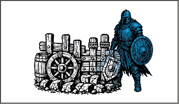

Model is in LoS and has cover, because the majority of it is obscured.

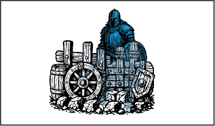

No LoS because the model is in cover and hidden.

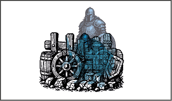

## Movement

There are different types of movement that may alter the total distance a model can travel or the way it interacts with terrain and other models. Unless stated otherwise, a model may move a number of inches equal to its MOV characteristic.

##### Climb

Reduce movement by 1″ to climb vertically up or down. Unless stated otherwise, a climbing aid (e.g. ladder, rope) is required to perform a Climb.

##### Jump

Jump across a gap up to half the model’s MOV. This counts as part of normal movement.

##### Traverse

Move over an obstacle smaller than the model’s height by spending 2″ of movement.

##### Drop

You may drop down up to 2″ without spending MOV.

For heights above 2″, roll a Defense die for each additional inch. On a failed roll, suffer 1 damage per failed inch.

##### Push

Move action. Push an enemy model of equal or smaller height up to 2" directly away.

You must begin not in Base Contact with the target and end in Base Contact with it.

The target rolls one Defense Die against its SAV. On a failure it is pushed. On a success the push fails and your move counts as a Charge in every respect; you are in Base Contact and may follow up with a Fight action as normal.

##### Run

Use the Run action to double the model’s MOV value for this move.

Cannot be combined with other movement types, except Jump or Push.

1.  Fly / Teleport

Models with the Fly or Teleport trait ignore all obstacles and terrain during movement. The model’s movement must start and end on open terrain.

1.  Falling

If a model falls unintentionally from a height over 2″, roll a Defense die for each inch above 2″.

Each failed roll causes 1 damage. A roll of 1 also Stuns the model.

1.  Base Contact

Two models are in Base Contact when their bases touch or are within 1″ of each other. Base Contact is required for Close Combat and is referenced by Charge, Push, Interact and many special rules.

1.  Jump Attack

When a model performs a Charge from a height of up to 3″ and enters Base Contact as part of a Drop, it gains an additional critical hit in the following Close Combat sequence.

## Terrain

Terrain shapes the battlefield and influences every move your warriors make. It affects movement, line of sight, available actions, and cover.

- Before the game begins, players must agree on the type and rules of each terrain piece used on the board. Consistent classification ensures fair and strategic gameplay.
- Walls, Buildings, Large Rocks, etc. are impassable and block Line of Sight.

| Open Terrain | Grass Fields, Roads, Open Plazas |
|----|----|
| 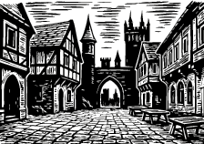 | No special effects. Models move normally and may be targeted without penalty. |

<table>
<thead>
<tr>
<th scope="col">
Small Objects
</th>
<th scope="col">
Barrels, Crates, Gravestones, Rubble Pile, Small Barricades
</th>
</tr>
</thead>
<tbody>
<tr>
<td>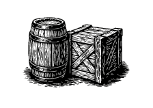</td>
<td><ul>
<li>Objects ≤ 1″ high.</li>
<li>Grants Cover.</li>
<li>Can be Traversed without movement penalty.</li>
</ul></td>
</tr>
</tbody>
</table>

<table>
<thead>
<tr>
<th scope="col">
Field Defenses
</th>
<th scope="col">
Barricades, Stone Wall Sections, Fallen Statues
</th>
</tr>
</thead>
<tbody>
<tr>
<td>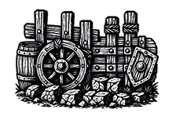</td>
<td><ul>
<li>Objects smaller than the model’s height.</li>
<li>Grants Cover.</li>
<li>Can be Traversed by spending 2″ of movement.</li>
</ul></td>
</tr>
</tbody>
</table>

<table>
<thead>
<tr>
<th scope="col">
Entryways
</th>
<th scope="col">
Doors, Gates, Grills, Windows
</th>
</tr>
</thead>
<tbody>
<tr>
<td>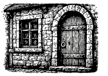</td>
<td><ul>
<li>Passable only when unlocked.</li>
<li>Use the INTERACT action to lock or unlock.</li>
</ul></td>
</tr>
</tbody>
</table>

<table>
<thead>
<tr>
<th scope="col">
Loot Sites
</th>
<th scope="col">
Treasure Chests, Weapon Racks, Supply Crates
</th>
</tr>
</thead>
<tbody>
<tr>
<td>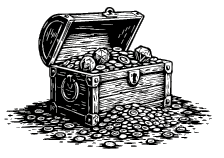</td>
<td>
Within 1″, use Interact to search. Roll D66 on the Equipment Table.

<ul>
<li>Once per object.</li>
<li>Each mission defines which Loot Sites are available.</li>
</ul></td>
</tr>
</tbody>
</table>

<table>
<thead>
<tr>
<th scope="col">
Elevated Ground
</th>
<th scope="col">
Upper Floor, Roof, Hill, Tower, Lookout
</th>
</tr>
</thead>
<tbody>
<tr>
<td>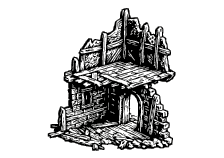</td>
<td><ul>
<li>At least 3″ above ground level.</li>
<li>Models standing here gain access to the TAKE AIM special action.</li>
</ul></td>
</tr>
</tbody>
</table>

<table>
<thead>
<tr>
<th scope="col">
Climbing Gear
</th>
<th scope="col">
Ladders, Ropes
</th>
</tr>
</thead>
<tbody>
<tr>
<td>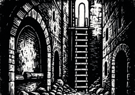</td>
<td><ul>
<li>Models may climb up or down by spending 1" of movement.</li>
</ul></td>
</tr>
</tbody>
</table>

<table>
<thead>
<tr>
<th scope="col">
Difficult Terrain
</th>
<th scope="col">
Woods, Shallow Waters, Swamp, Rubble, Thick Undergrowth
</th>
</tr>
</thead>
<tbody>
<tr>
<td>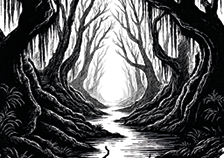</td>
<td><ul>
<li>Models cannot use the RUN action while moving through this terrain.</li>
</ul></td>
</tr>
</tbody>
</table>

<table>
<thead>
<tr>
<th scope="col">
Dangerous Terrain
</th>
<th scope="col">
Deadly or Poisonous Vegetation, Quick Sand, Flames
</th>
</tr>
</thead>
<tbody>
<tr>
<td>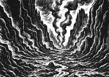</td>
<td><ul>
<li>Models cannot use the RUN action while moving through this terrain.</li>
<li>Model takes D3 Fatal Wounds per movement action.</li>
</ul></td>
</tr>
</tbody>
</table>

## Close Combat

The model that declares a Fight action and begins this sequence in Base Contact is the Attacker; the opposing model is the Defender.

1.  Engage

Choose one enemy model in Base Contact (1″). It becomes the Defender.

1.  Choose Weapons

Each player picks one Close Combat weapon profile for their model (Type close).

If a model has no melee weapon, use the\
Unarmed profile.

##### Main and Off-hand weapon

A model equipped with two Close Combat weapons may attack with both. The player must declare beforehand which weapon is the main hand and which is the off hand. The off-hand weapon may only perform 1 ATK.

##### Unarmed:

Models without a Close Combat weapon may use the following Unarmed Profile in Close Combat, representing their fists or makeshift weapon.

| name    | RNG | ATK | htv | DMG | crt |
|---------|-----|-----|-----|-----|-----|
| Unarmed | 1″  | 2   | 5+  | 1   | 1   |

1.  Roll Dice

Both players roll their Attack Dice and, if they have any, their Block Dice. Keep the two kinds separate.

- A roll of 6 is always a critical success and may trigger additional rules.
- A roll of 1 is always a failure and may trigger additional rules.
- Dice that are not successful are removed.

##### Attack Dice

- Roll a number of D6 equal to the weapon’s ATK.
- A result equal to or higher than the weapon's HTV is a normal success. A 6 is a critical success.
- A successful Attack Die is spent either to Strike or to Parry (see Resolve Dice).

##### Block Dice

- Bonus dice granted by Armor, Shields or other rules. They have no HTV; the number rolled is what counts.
- A Block Die is spent only to block an enemy success (see Resolve Dice). It can never Strike.

##### Retained Dice

Some rules let a model retain a die as a normal success without rolling it. A retained Attack Die counts as showing the weapon's HTV.

##### Assist:

Each friendly model that is also in Base Contact with the Defender improves the Attacker's HTV by 1 (to a minimum of 2+).

1.  Resolve Dice

The Attacker spends one die first. Players then alternate, spending one die at a time, until every successful die has been spent or a model is Defeated. A die is spent in one of three ways:

Strike: Spend a successful Attack Die to deal damage. A normal success inflicts the weapon's DMG. A critical success inflicts the weapon's CRT, and the Defender rolls on the Critical Injuries table immediately.

Parry: Spend a successful Attack Die to cancel one of your opponent's unspent successes. A normal success cancels a normal success; a critical success cancels any success. Both dice are removed.

Block: Spend a Block Die to cancel one of your opponent's unspent successes of equal or lower value. Both dice are removed. A Block Die showing a 6 can therefore block a critical success. Block Dice can only be spent this way.

- Damage from a Strike is applied at once. A die that has been spent to Strike can no longer be parried or blocked.
- If one player runs out of dice, the other player spends all remaining dice in any order.
- A model reduced to 0 Vitality is Defeated and removed from the game.

1.  Traits

Some important Traits that affect combat.

##### \

##### Buckler:

Grants 1 Block Die. It cannot block critical success.

##### Shield:

Grants 1 Block Die.

##### Medium Armor:

Grants 1 Block Die.

##### Heavy Armor:

Grants 1 Block Die. Roll 2 Dice and keep the higher result.

##### Master Parry:

1 normal success may parry 1 enemy crit.

##### Guard

Any or all Block Dice may be re-rolled once.

##### Cleave

If you retain at least one critical success, you may upgrade one normal success to a critical success.

##### First Strike:

During Resolve Dice, this model spends the first die. Alternate as normal afterwards.

Example:

Both models have HTV 4+. Player 1, the Attacker, rolls 3 Attack Dice showing 6, 4 and 2, and 1 Block Die from a Shield showing 5. Player 2 rolls 3 Attack Dice showing 5, 5 and 3. The 2 and the 3 are failures and are removed.\
\
1. Player 1 Strikes with the 6: a critical hit. Player 2 suffers CRT damage and rolls for Critical Injuries. The 6 is spent and can no longer be parried.\
2. Player 2 Parries Player 1's 4 with a 5. Normal cancels normal; both dice are removed.\
3. Player 1 spends the Block Die (5) to block Player 2's remaining 5. Equal value, so the block is allowed; both dice are removed. Had the Block Die shown a 4, it could not have blocked the 5.\
\
No dice remain. Player 1 has dealt one critical hit, Player 2 no damage. Spending your best die first denies the opponent the chance to parry it.

## Ranged Combat

The model that declares a Shoot action is the Attacker; the chosen target is the Defender.

1.  Select Weapon

The Attacker chooses one of the model’s ranged weapon profiles (Type range).

1.  Acquire Target
    - The Attacker selects a target in the model’s Line of Sight and within the weapon’s maximum range.
    - The target needs to be at least 2" away.
    - The target becomes the Defender.

##### Nearest Foe

If any enemy model within 8" is a legal target (in Line of Sight, not Hidden, within the weapon's range), the Attacker must target the closest such enemy. Enemies that are not legal targets are ignored for this rule.

1.  Roll Attack Dice
    - The Attacker rolls a number of D6 equal to the weapon’s ATK value.
    - A result ≥ HTV is a normal success.
    - A 6 is a critical success and may trigger additional rules.
    - A roll of 1 is an automatic fail and may trigger additional rules.
    - Dice that are not successful are removed.
2.  Roll Defense Dice
    - The Defender rolls a number of D6 equal to his DEF value.
    - A result ≥ SAV is a normal success.
    - A 6 is a critical success and may trigger additional rules.
    - A roll of 1 is an automatic fail and may trigger additional rules.
    - Dice that are not successful are removed.
3.  Resolve Defense Dice

The Defender spends their successful dice first:

- Critical success: Discards one of the Attacker’s normal or critical successes.
- Normal success: Discards one normal success. Two normal successes together may discard one critical success.

After each Defense Die is spent, remove it.

1.  Deal Damage

The Attacker resolves all remaining successful Attack Dice:

- A normal success inflicts damage equal to the weapon’s DMG value.
- A critical success inflicts damage equal to the weapon’s CRT value and the model needs to roll for Critical Injuries immediately.

Reduce the Defender’s Vitality accordingly. A model whose Vitality is reduced to 0 is Defeated and removed from the game.

1.  Traits

Some important Traits and Rules that affect combat.

##### Cover

Defender's SAV improved by 1 (min 2+).

##### Shoot into Combat

If the targeted Defender is in Base Contact with a friendly model, all failed attack dice must be rerolled.

These rerolled dice are now resolved against the friendly model instead.

##### Take Aim

If a model is positioned on Elevated Terrain, it may declare the Take Aim action before shooting. See Special Actions on page 24 for details.

##### Armor Piercing

The Defender's SAV value is worsened by 1 (to a minimum of 6+).

##### Armor Shatter

Defender rolls one Defense Die fewer (min 1) and SAV worsened by 1 (min 6+).

##### Cleave

If you retain at least one critical success, you may upgrade one normal success to a critical success.

1.  Effective Range

Ranged weapons are less accurate at extreme distances.

When making a Ranged Attack against a target more than 8" away, the attacker's HTV is worsened by 1.

Only weapons are affected. Magical spells do not suffer a HTV penalty.

1.  Misfire Table

When a weapon with the Black Powder or Warp Tech trait requires a Misfire check, roll 1D6 and consult the table below:

| D6 | Name | Description |
|----|----|----|
| 1 | Flashback | Burning powder ignites the wielder. The wielder suffers D3 Fatal Wounds and gains the Burning status effect. |
| 2-3 | Jammed | The mechanism is fouled. Requires two INTERACT actions to clear the blockage and reload. |
| 4-6 | Minor Spark | The shot fails. May reload normally with one INTERACT action. |

## Vitality

Each model has a Vitality (VIT) characteristic, representing its total health. Whenever a model suffers damage, reduce its VIT accordingly.

1.  Fatal Damage

Fatal Damage cannot be blocked and ignores Defense throws.

1.  Defeated

A model is Defeated when its VIT is reduced to 0 or less. Remove it from the game immediately.

1.  Healing
    - A model can be healed, but not beyond its starting VIT value.
    - If a model is healed to full VIT, remove any Critical Injuries it suffered during the game.
2.  Critical Injuries

Whenever a model suffers damage from a critical hit in combat, roll on the Critical Injuries Table. Apply the result immediately.

- Each injury effect lasts for the remainder of the game.
- A model can only suffer each type of critical injury once per game.
- In campaign play, roll on the Injured Models Table after the mission to determine if the injury persists.

1.  Critical Injuries Table

| D6    | Type       | Effect            |
|-------|------------|-------------------|
| 1     | Head       | HTV worsened by 1 |
| 2     | Arm        | ATK -1            |
| 3     | Leg        | MOV -1            |
| 4 - 6 | Fleshwound | none              |

- Use tokens or a marker to track active injuries.

##### Helmet

Ignore results of 1 (Head) on the Critical Injuries Table.

## Status Effects

Certain rules, attacks, or spells may inflict lasting conditions on a model. These are called Status Effects. Each effect alters the model’s capabilities until removed.

- Status effects remain on a model until removed by a rule or an Action.
- A model cannot be affected by the same status effect more than once.

<table>
<thead>
<tr>
<th></th>
<th scope="col">
Effect
</th>
<th scope="col">
Removed by
</th>
</tr>
</thead>
<tbody>
<tr>
<td></td>
<td>
Stunned

Can only perform RECOVER or PASS.
</td>
<td>
RECOVER 
CLEANSE
</td>
</tr>
<tr>
<td></td>
<td>
Burning

Suffers 1D3 Fatal Damage at the start of each turn.
</td>
<td>
RECOVER 
CLEANSE
</td>
</tr>
<tr>
<td></td>
<td>
Frozen

Movement is reduced by 2".
</td>
<td>
RECOVER 
CLEANSE
</td>
</tr>
<tr>
<td></td>
<td>
Fearful

HTV worsened by 1 for all attacks.
</td>
<td>
RECOVER 
CLEANSE
</td>
</tr>
<tr>
<td></td>
<td>
Poisoned

Suffers 1 Fatal Damage at the end of each turn.
</td>
<td>
HEAL 
CLEANSE
</td>
</tr>
<tr>
<td>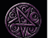</td>
<td>
Cursed

Rolls of 1 on any Attack or Block Dice cause 1 Fatal Damage.
</td>
<td>
CLEANSE
</td>
</tr>
<tr>
<td></td>
<td>
Head Injury

HTV worsened by 1.
</td>
<td>
100% 
HEAL
</td>
</tr>
<tr>
<td>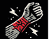</td>
<td>
Arm Injury

–1 ATK (Fewer attack dice).
</td>
<td>
100% 
HEAL
</td>
</tr>
<tr>
<td></td>
<td>
Leg Injury

–1 MOV (Reduced movement).
</td>
<td>
100% 
HEAL
</td>
</tr>
</tbody>
</table>

## Arcane & Divine Powers

Some models may harness supernatural forces through either Arcane Magic or Divine Invocations. These powers are represented by special actions and are available only to models with the appropriate trait. All supernatural powers require energy to activate: Arcane Energy or Divine Energy.

1.  Arcane Magic

Models with the Arcane trait may perform the CAST A SPELL action to generate Arcane Energy and cast a spell from their Warband’s selected Arcane Lore.

##### Arcane Energy

When you cast a spell, roll 2D6 to generate Arcane Energy (AE). You may only cast a spell if its energy cost is equal to or less than the AE rolled.

- Each die that shows a result of 1 causes the caster to suffer 2 Fatal Damage.
- Arcane Energy is temporary and must be used during the action. It cannot be stored or transferred.
- Spells from Magic Scrolls may be cast without rolling for Arcane Energy.

1.  Divine Invocations

Models with the Divine trait may perform the INVOCATION action to call upon a power from a Divine Lore.

##### Divine Energy

When performing an Invocation, roll 2D6 to generate Divine Energy (DE). You may only invoke a power if its cost is equal to or less than the DE rolled.

- Divine Energy is temporary and must be used during the action. It does not cause harm on low rolls and cannot be stored or transferred.

1.  Arcane & Divine Lores

Each warband may choose one Arcane Lore and one Divine Lore, each only if it fields a model with the matching trait.

- Arcane Lores contain Spells and may only be used by models with the Arcane rule.
- Divine Lores contain Invocations and may only be used by models with the Divine rule.
- Each power may be used once per activation.
- Mixed Warbands (e.g. Mercenaries) may only choose from the following universal Lores.
- Additional Lores are detailed in the respective Factions Traits.

1.  

##### Lesser Magic

This Arcane Lore is available to models with the Arcane trait in all Warbands.

| Name | Description | AE |
|----|----|----|
| Fog of War | Target a friendly model within 12". That model is considered Hidden until the end of its next activation | 3 |
| Teleport | Move the caster up to 12" in a straight line to a visible position. Ignore terrain and obstacles during this move. If the destination is in Base Contact with an enemy, this counts as a Charge action. | 4 |
| Fireball | Make a ranged attack (RNG 12", ATK 3, HTV 4+, DMG 3, CRT 4). The attack has the Fire weapon rule. | 5 |
| Healing Touch | Counts as performing a HEAL action. | 5 |
| Arcane Barrier | Target a model within 12". That model gains Protected until the end of its next turn (it may retain one defence die as a normal save or block without rolling). | 6 |
| Fortune’s Thread | Target a model within 24". That model may re-roll one upcoming dice result. The second result must be accepted. | 9 |

##### Minor Rites

This Divine Lore is available to models with the Divine trait in all Warbands.

<table>
<thead>
<tr>
<th scope="col">
Name
</th>
<th scope="col">
Description
</th>
<th scope="col">
DE
</th>
</tr>
</thead>
<tbody>
<tr>
<td>
Soothing Chant
</td>
<td>
Select a friendly model within 12″. Remove any of the following status effects:

Burning, Cursed, Poisoned, Fearful, Stunned, Frozen.
</td>
<td>
3
</td>
</tr>
<tr>
<td>
Guiding Steps
</td>
<td>
Choose a friendly model within 12". That model gains +1" MOV until the end of its next activation.
</td>
<td>
4
</td>
</tr>
<tr>
<td>
Balancing Touch
</td>
<td>
Target a friendly model within 6". Until the end of the round, it may re-roll one defense die in any defense roll.
</td>
<td>
6
</td>
</tr>
<tr>
<td>
Ritual of Endurance
</td>
<td>
Choose a friendly model within 6". It heals D3 Vitality. No additional status effects are removed.
</td>
<td>
7
</td>
</tr>
</tbody>
</table>

